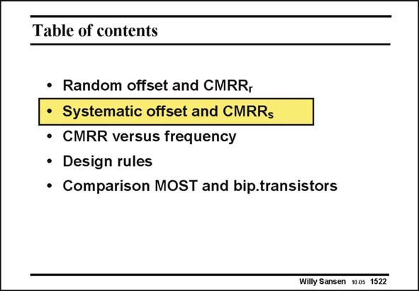

# SANSEN-1522 · Table of contents

章节：15 失调与共模抑制比：随机误差及系统误差  
PDF 页：424；书本页：432；幻灯片编号：1522  
状态：unreviewed



## 对应教材讲解

### PDF 424 · 书本 432

Up till now only random effects have been examined. They lead to a random offset and random CMRR, which are linked by each other. Systematic errors can also occur. In general, they are the result of systematic asymmetries. In principle, they can be avoided by proper design, as they are systematic. They give rise to a systematic offset and systematic CMRR which are also linked. Some examples are given next.

## 公式／性能结论候选摘录

以下为规则截取的原文，尚未逐项判读。

（未由规则找到；不代表原页没有此类内容。）

## 曲线结论候选摘录

以下为规则截取的原文，尚未逐项判读。

（未由规则找到；不代表原页没有此类内容。）

## 原文条件与近似候选摘录

以下为规则截取的原文，尚未逐项判读。

（未由规则找到；不代表原页没有此类内容。）

## 幻灯片 OCR（未校正）

```text
Table of contents
• Random offset and CMRR,
• Systematic offset and CMRRs
• CMRR versus frequency
• Design rules
• Comparison MOST and bip.transistors
Willy Sansen 10a5 1522
```

数学上下标、分数及正负号以原图为准。电路图已保留；未核对的连接不输出成可仿真 netlist。
