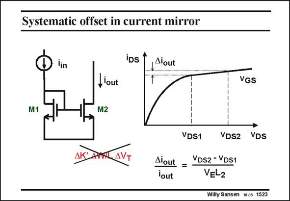

# SANSEN-1523 · Systematic offset in current mirror

章节：15 失调与共模抑制比：随机误差及系统误差  
PDF 页：424；书本页：432；幻灯片编号：1523  
状态：unreviewed



## 对应教材讲解

### PDF 424 · 书本 432

A first source of systematic error is caused by the systematic asymmetry of a current mirror. Even without random errors, a difference in Drain-Source voltage v , DS causes a small difference in output current Di , which out always has the same sign. It can easily be calculated, leading to the expression in this slide. The larger the channel length, the more horizontal the curves are and the smaller the output current difference. It can never be made zero however, as it is just about impossible to make v exactly DS1 equal to v . DS2

## 公式／性能结论候选摘录

以下为规则截取的原文，尚未逐项判读。

- PDF 424: It can never be made zero however, as it is just about impossible to make v exactly DS1 equal to v .

## 曲线结论候选摘录

以下为规则截取的原文，尚未逐项判读。

- PDF 424: The larger the channel length, the more horizontal the curves are and the smaller the output current difference.

## 原文条件与近似候选摘录

以下为规则截取的原文，尚未逐项判读。

（未由规则找到；不代表原页没有此类内容。）

## 幻灯片 OCR（未校正）

```text
Systematic offset in current mirror
iDs 1
1Alout
M1
,out
M2
VGS
Aiout =
lout
VDS1
VDS2
VDS
VDS2 - VDS1
VEL2
Willy Sansen 1005 1523
```

数学上下标、分数及正负号以原图为准。电路图已保留；未核对的连接不输出成可仿真 netlist。
