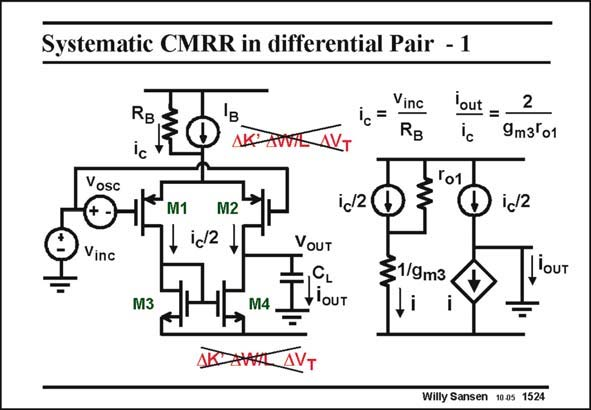

# SANSEN-1524 · Systematic CMRR in differential Pair - 1

章节：15 失调与共模抑制比：随机误差及系统误差  
PDF 页：425；书本页：433；幻灯片编号：1524  
状态：unreviewed



## 对应教材讲解

### PDF 424 · 书本 432

Another source of systematic error is a result of the common-mode drive v of a differential inc pair, as shown in this slide. The systematic asymmetry of the current mirror gives a differential output current i . This current can then be compensated at the input by a differential input OUT voltage or offset voltage v . osc In order to calculate the offset voltage required to compensate for the output current caused by the common-mode input voltage v , a small signal equivalent circuit is sketched. inc

### PDF 425 · 书本 433

The common-mode input voltage v causes a current inc i to flow through the output c resistance R of the current B source. Half of this current flows through both input devices. They can now be represented by two current sources with value i /2. c The load can be taken to be a short to ground, as intermediate frequencies are considered. The current through it is the differential output current i . As a OUT result, only r has to be o1 included. The current mirror has been simplified to a resistor with value 1/g . The current through it m3 is mirrored to the output. From this simplified equivalent circuit, the output current is easily calculated. It evidently depends on g and r . m3 o1

## 公式／性能结论候选摘录

以下为规则截取的原文，尚未逐项判读。

- PDF 425: It evidently depends on g and r . m3 o1

## 曲线结论候选摘录

以下为规则截取的原文，尚未逐项判读。

（未由规则找到；不代表原页没有此类内容。）

## 原文条件与近似候选摘录

以下为规则截取的原文，尚未逐项判读。

（未由规则找到；不代表原页没有此类内容。）

## 幻灯片 OCR（未校正）

```text
Systematic CMRR in differential Pair - 1
RB.
Ic
Vinc
RB
lout
2
9m3°01
Vosc
To1
M1
M2
ic/2
id2
Vinc
M3
M4
VOUT
CL
OUT
1/9m3
louT
Willy Sansen 10a5 1524
```

数学上下标、分数及正负号以原图为准。电路图已保留；未核对的连接不输出成可仿真 netlist。
