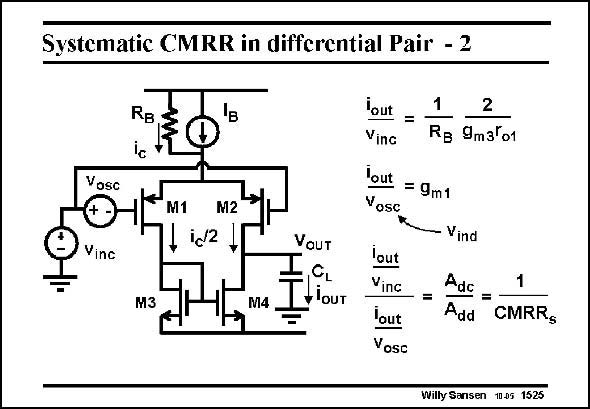

# SANSEN-1525 · Systematic CMRR in ditferential Pair - 2

章节：15 失调与共模抑制比：随机误差及系统误差  
PDF 页：425；书本页：433；幻灯片编号：1525  
状态：unreviewed



## 对应教材讲解

### PDF 425 · 书本 433

This output current i , OUT can now be referred back to the input by simple division by g . The offset voltage m1 v is merely this output osc current divided by g . m1 Note however, that the ratio of the output current caused by the commonmode voltage to the output current caused by the differential input voltage or offset voltage, is nothing else than the inverse of the CMRR . This is the link s between systematic offset voltage and systematic CMRR . s The actual expression is given next.

## 公式／性能结论候选摘录

以下为规则截取的原文，尚未逐项判读。

（未由规则找到；不代表原页没有此类内容。）

## 曲线结论候选摘录

以下为规则截取的原文，尚未逐项判读。

（未由规则找到；不代表原页没有此类内容。）

## 原文条件与近似候选摘录

以下为规则截取的原文，尚未逐项判读。

（未由规则找到；不代表原页没有此类内容。）

## 幻灯片 OCR（未校正）

```text
Systematic CMRR in ditferential Pair - 2
RB
Vosc
M1
M2
id2
Vinc
M3
M4
VaUT
CL
-lOUT
Yout
Ving
lout
= 9m1
Vosc
lout
Vinc
lout
Vosc
2
Re 9m3Ґo1
Vind
Adc
1
Add CMRRg
Willy Sansen 1005 1525
```

数学上下标、分数及正负号以原图为准。电路图已保留；未核对的连接不输出成可仿真 netlist。
