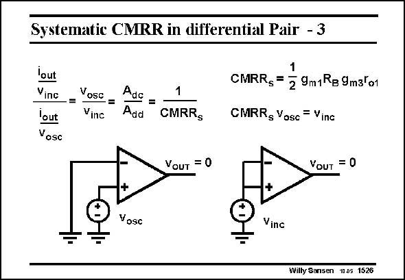

# SANSEN-1526 · Systematic CMRR in differential Pair - 3

章节：15 失调与共模抑制比：随机误差及系统误差  
PDF 页：426；书本页：434；幻灯片编号：1526  
状态：unreviewed



## 对应教材讲解

### PDF 425 · 书本 433

Substitution of several gains by means of the transistor parameters yields the CMRR . Its value s is quite large as two g r products are multiplied. m o Again, the product of the CMRR and the offset amounts to some constant value, which is the

### PDF 426 · 书本 434

common-mode input voltage in this case. Its value is quite limited. As a result, high values of commonmode rejection can only be reached provided the offset is quite small. It is now also clear that the output voltage of an opamp can be made zero either by application of a differential input voltage, which is by definition the offset voltage v , or by osc application of a commonmode input voltage v . inc Their ratio is then the CMRR. An easy measurement technique for the CMRR consists of the application of a certain differential input voltage v , and by measurement of the common-mode input voltage v osc inc required to return the output voltage to the original value. Their ratio is again the CMRR.

## 公式／性能结论候选摘录

以下为规则截取的原文，尚未逐项判读。

- PDF 426: Its value is quite limited.
- PDF 426: As a result, high values of commonmode rejection can only be reached provided the offset is quite small.

## 曲线结论候选摘录

以下为规则截取的原文，尚未逐项判读。

（未由规则找到；不代表原页没有此类内容。）

## 原文条件与近似候选摘录

以下为规则截取的原文，尚未逐项判读。

- PDF 426: As a result, high values of commonmode rejection can only be reached provided the offset is quite small.

## 幻灯片 OCR（未校正）

```text
Systematic CMRR in differential Pair - 3
lout
Vinc
lout
Vosc
Vosc
-=
Vine
Adc
Add
1
CMRRs
CMRRs =
29m1 Rg 9m3lo1
CMRRg Vosc = Vinc
VouT = 0
YouT = 0
Vosc
Vinc
Willy Sansen 1005 1526
```

数学上下标、分数及正负号以原图为准。电路图已保留；未核对的连接不输出成可仿真 netlist。
