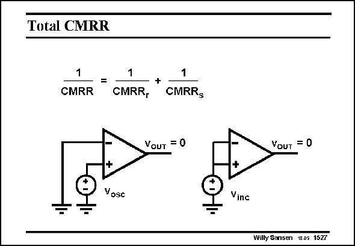

# SANSEN-1527 · Total CMRR

章节：15 失调与共模抑制比：随机误差及系统误差  
PDF 页：426；书本页：434；幻灯片编号：1527  
状态：unreviewed



## 对应教材讲解

### PDF 426 · 书本 434

However, in this way both the random CMRR and the r systematic CMRR are meas sured. The smaller one always dominates.

## 公式／性能结论候选摘录

以下为规则截取的原文，尚未逐项判读。

（未由规则找到；不代表原页没有此类内容。）

## 曲线结论候选摘录

以下为规则截取的原文，尚未逐项判读。

（未由规则找到；不代表原页没有此类内容。）

## 原文条件与近似候选摘录

以下为规则截取的原文，尚未逐项判读。

（未由规则找到；不代表原页没有此类内容。）

## 幻灯片 OCR（未校正）

```text
Total CMRR
1
CMRR
=
1
CMRR,
+
1
CMRR$
VouT = 0
+
Vosc
YoUT = 0
+
Vinc
Willy Sansen 10.05 1527
```

数学上下标、分数及正负号以原图为准。电路图已保留；未核对的连接不输出成可仿真 netlist。
