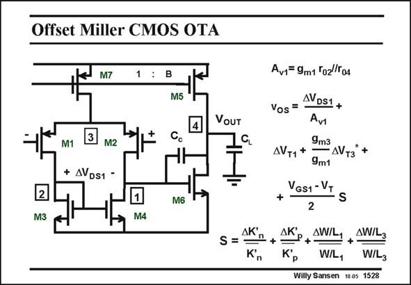

# SANSEN-1528 · Offset Miller CMOS OTA

章节：15 失调与共模抑制比：随机误差及系统误差  
PDF 页：427；书本页：435；幻灯片编号：1528  
状态：unreviewed



## 对应教材讲解

### PDF 426 · 书本 434

A CMOS Miller OTA is shown in this slide. The offset of such an amplifier is examined next. The input devices are normally pMOSTs so that they can share the same n-well bulk. In this way mismatch in substrate parameter c does not come in. This parameter does come in however, for the nMOSTs. This is why the term DV has an asterisk. It is larger without the effect of the T3 substrate parameter.

### PDF 427 · 书本 435

The offset voltage is given in this slide. First of all, it includes any difference between nodes 1 and 2, which is called DV . This DS1 difference can be caused by a difference between V GS6 and V . It also includes GS3 the large AC voltage swing at node 1, which is much smaller on node 2. The second and third term are caused by the mismatches between the V ’s. T The last term includes the mismatches between the sizes and the K∞ factors. They are obviously scaled by V −V . GS1 T For a small value of V −V and for a small g /g , the term DV is probably dominant GS1 T m3 m1 T1 if DV can be kept small. If not, its contribution to the offset is DV /A or V /A A . DS1 DS1 v1 OUT v1 v2

## 公式／性能结论候选摘录

以下为规则截取的原文，尚未逐项判读。

（未由规则找到；不代表原页没有此类内容。）

## 曲线结论候选摘录

以下为规则截取的原文，尚未逐项判读。

（未由规则找到；不代表原页没有此类内容。）

## 原文条件与近似候选摘录

以下为规则截取的原文，尚未逐项判读。

- PDF 427: It also includes GS3 the large AC voltage swing at node 1, which is much smaller on node 2.

## 幻灯片 OCR（未校正）

```text
Offset Miller CMOS OTA
JM7
1
M5
VOUT
M1
3
M2
+ AVDS1 -
2
M3
M6
M4
AK'
S =
n
Aur= 9m1 To2/To4
Vos =
AVDS1 +
Avi
AVT1+
9m3
- AVт3
*+
9m1
VGS1 - VT
+
S
2
AK'
Kр
AW/L.
+
AWIL3
WL1
WIL3
Willy Sansen 1005 1528
```

数学上下标、分数及正负号以原图为准。电路图已保留；未核对的连接不输出成可仿真 netlist。
