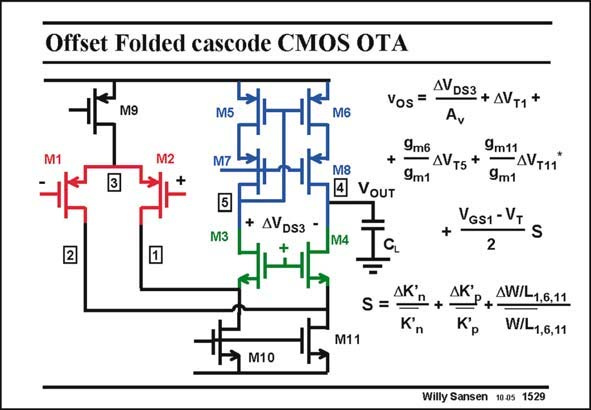

# SANSEN-1529 · Offset Folded cascode CMOS OTA AVDS3 + AV+1 *

章节：15 失调与共模抑制比：随机误差及系统误差  
PDF 页：427；书本页：435；幻灯片编号：1529  
状态：unreviewed



## 对应教材讲解

### PDF 427 · 书本 435

A folded cascode OTA is shown in this slide. Its offset voltage is examined next. The offset voltage v is os given in this slide. It firstly includes any difference between nodes 4 and 5, which is called DV . It is DS3 mainly the large AC voltage swing at node 4, which is much smaller on node 5. The next three terms are caused by the mismatches between the V ’s. They are T equally important depending on the g ’s. The last m term includes the mismatches between the sizes and the K∞ factors. They are obviously scaled by V −V . The cascodes do not come in. GS1 T This clearly shows that the offset of a folded cascode can be quite large, as it is made up by the spreading of three differential pairs. Similar conclusions can be drawn as for the CMOS Miller opamp.

## 公式／性能结论候选摘录

以下为规则截取的原文，尚未逐项判读。

- PDF 427: They are T equally important depending on the g ’s.

## 曲线结论候选摘录

以下为规则截取的原文，尚未逐项判读。

（未由规则找到；不代表原页没有此类内容。）

## 原文条件与近似候选摘录

以下为规则截取的原文，尚未逐项判读。

- PDF 427: It is DS3 mainly the large AC voltage swing at node 4, which is much smaller on node 5.

## 幻灯片 OCR（未校正）

```text
Offset Folded cascode CMOS OTA
M9
M5
M6
M8
• VouT
+ AVDs3 -
M3
M4
Vos =
AVDS3 + AV+1 *
9m6
9m11
- AVT5 +
-AVT11
9m1
9m1
VGS1 -V.
N
S
2
S =
AК'
n
Kn
ДК'
Kp
AW/L1,6,11
W/L1,6,11
M10
Willy Sansen 1005 1529
```

数学上下标、分数及正负号以原图为准。电路图已保留；未核对的连接不输出成可仿真 netlist。
