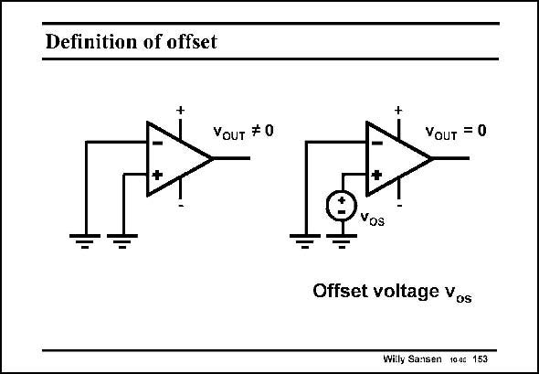

# SANSEN-153 · Definition of offset

章节：15 失调与共模抑制比：随机误差及系统误差  
PDF 页：414；书本页：422；幻灯片编号：153  
状态：unreviewed



## 对应教材讲解

### PDF 413 · 书本 421

When a single-ended opamp is taken with zero differential input voltage, its output voltage should be zero, whatever the gain is. In practice, this is not the case. The output voltage is not zero. The offset voltage v is now by definition the differential input voltage that is required to os make the output voltage zero. Since it is a differential input voltage it can be inserted in either

### PDF 414 · 书本 422

one of the two input terminals. In this example, the offset voltage is inserted in the plus terminal. When shifted to the minus terminal it has the same value but opposite sign. It is usually a few mV’s for a bipolar amplifier. For a CMOS amplifier it can be up to ten times larger! What causes this offset voltage? Random effects can play a role, but also systematic ones.

## 公式／性能结论候选摘录

以下为规则截取的原文，尚未逐项判读。

- PDF 413: When a single-ended opamp is taken with zero differential input voltage, its output voltage should be zero, whatever the gain is.

## 曲线结论候选摘录

以下为规则截取的原文，尚未逐项判读。

（未由规则找到；不代表原页没有此类内容。）

## 原文条件与近似候选摘录

以下为规则截取的原文，尚未逐项判读。

（未由规则找到；不代表原页没有此类内容。）

## 幻灯片 OCR（未校正）

```text
Definition of offset
VoUT # 0
VouT = 0
Yos
Offset voltage Vos
Willy Sansen 1000 153
```

数学上下标、分数及正负号以原图为准。电路图已保留；未核对的连接不输出成可仿真 netlist。
