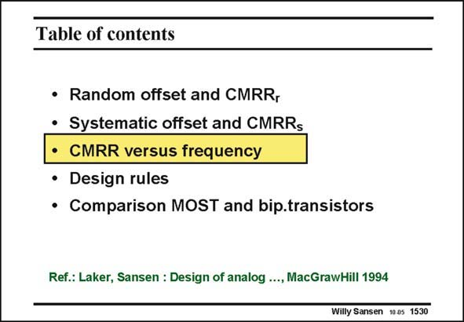

# SANSEN-1530 · Table of contents

章节：15 失调与共模抑制比：随机误差及系统误差  
PDF 页：428；书本页：436；幻灯片编号：1530  
状态：unreviewed



## 对应教材讲解

### PDF 428 · 书本 436

The expression of the CMRR may have led to the conclusion that the output resistance of the current source, feeding the differential pair, is of utmost importance. This is true, at least at low frequencies. At intermediate and high frequencies, the output capacitance of this current source is of even more importance, as shown next.

## 公式／性能结论候选摘录

以下为规则截取的原文，尚未逐项判读。

- PDF 428: The expression of the CMRR may have led to the conclusion that the output resistance of the current source, feeding the differential pair, is of utmost importance.

## 曲线结论候选摘录

以下为规则截取的原文，尚未逐项判读。

（未由规则找到；不代表原页没有此类内容。）

## 原文条件与近似候选摘录

以下为规则截取的原文，尚未逐项判读。

（未由规则找到；不代表原页没有此类内容。）

## 幻灯片 OCR（未校正）

```text
Table of contents
• Random offset and CMRR,
• Systematic offset and CMRRs
• CMRR versus frequency
• Design rules
• Comparison MOST and bip.transistors
Ref.: Laker, Sansen : Design of analog ..., MacGrawHill 1994
Willy Sansen 1005 1530
```

数学上下标、分数及正负号以原图为准。电路图已保留；未核对的连接不输出成可仿真 netlist。
