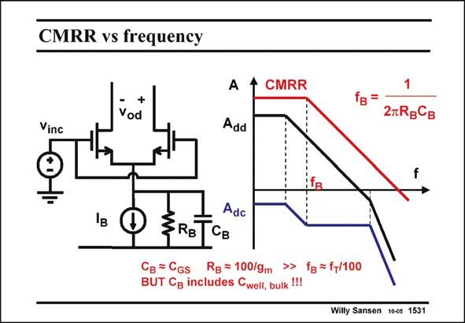

# SANSEN-1531 · CMRR vs frequency

章节：15 失调与共模抑制比：随机误差及系统误差  
PDF 页：428；书本页：436；幻灯片编号：1531  
状态：unreviewed



## 对应教材讲解

### PDF 428 · 书本 436

The current source of a differential pair has both an output resistance R and B capacitance C . Its size B depends mainly on the Drain-Bulk capacitance C DB of the current source transistor. Its value is close to that of the C of that transistor GS (as explained in Chapter 1). This capacitance C also B includes the capacitance C between the well, in well,bulk which both input transistors are imbedded, and the substrate. It can therefore be a lot larger than the C of the current source transistor. GS As a result, a new break frequency f shows up. It occurs as a zero in the characteristic of the B gain A , but as a pole in one of the CMRR. Calculation of this frequency depends on the values dc of these different capacitances. It will be somewhere between the dominant pole of the amplifier and a fraction of the f frequency of the current source transistor. T The best way to design a differential pair with high CMRR at high frequencies is to provide it with a current source with the minimum size of drain area. A small square device is optimal, most probably requiring a high value of V −V , which is good for its f as well! GS T T

## 公式／性能结论候选摘录

以下为规则截取的原文，尚未逐项判读。

- PDF 428: Its size B depends mainly on the Drain-Bulk capacitance C DB of the current source transistor.
- PDF 428: It can therefore be a lot larger than the C of the current source transistor.
- PDF 428: GS As a result, a new break frequency f shows up.
- PDF 428: It occurs as a zero in the characteristic of the B gain A , but as a pole in one of the CMRR.
- PDF 428: Calculation of this frequency depends on the values dc of these different capacitances.

## 曲线结论候选摘录

以下为规则截取的原文，尚未逐项判读。

- PDF 428: It occurs as a zero in the characteristic of the B gain A , but as a pole in one of the CMRR.

## 原文条件与近似候选摘录

以下为规则截取的原文，尚未逐项判读。

（未由规则找到；不代表原页没有此类内容。）

## 幻灯片 OCR（未校正）

```text
CMRR vs frequency
+
Vod
Vinc
A
Add
CMRR
fв =
2лRgСв
IB
Adc
3RBTCB
Cg = CGs
Rg = 100/9m >> fg =f+/100
BUT Cg includes Cwell, bulk !!!
Willy Sansen 10es 1531
```

数学上下标、分数及正负号以原图为准。电路图已保留；未核对的连接不输出成可仿真 netlist。
