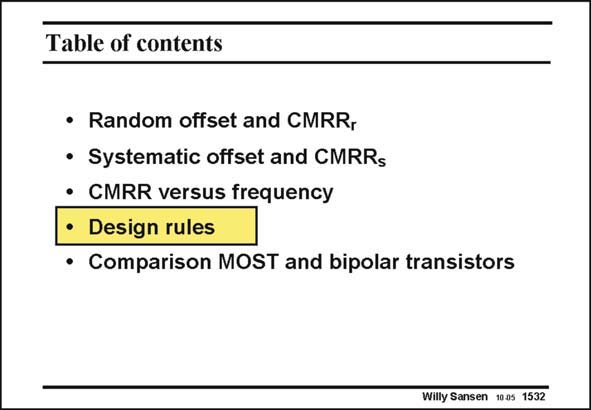

# SANSEN-1532 · Table of contents

章节：15 失调与共模抑制比：随机误差及系统误差  
PDF 页：429；书本页：437；幻灯片编号：1532  
状态：unreviewed



## 对应教材讲解

### PDF 429 · 书本 437

Mismatch is determined mainly by size and a number of other design rules, which are now discussed. It is already known that matching improves with the square root of the size. This is the main criterion. It always works. There are many other layout conditions however, which help in the reduction of mismatch. They all work to some extent, even when proof is not easy to find in the literature. They are summarized in 10 rules, as shown next.

## 公式／性能结论候选摘录

以下为规则截取的原文，尚未逐项判读。

（未由规则找到；不代表原页没有此类内容。）

## 曲线结论候选摘录

以下为规则截取的原文，尚未逐项判读。

（未由规则找到；不代表原页没有此类内容。）

## 原文条件与近似候选摘录

以下为规则截取的原文，尚未逐项判读。

（未由规则找到；不代表原页没有此类内容。）

## 幻灯片 OCR（未校正）

```text
Table of contents
• Random offset and CMRR,
• Systematic offset and CMRRs
• CMRR versus frequency
• Design rules
• Comparison MOST and bipolar transistors
Willy Sansen 10.05 1532
```

数学上下标、分数及正负号以原图为准。电路图已保留；未核对的连接不输出成可仿真 netlist。
