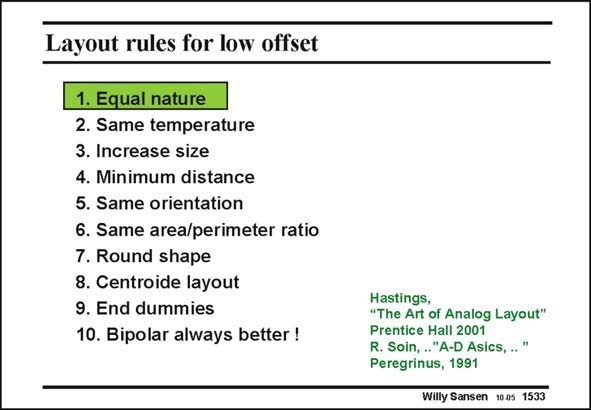

# SANSEN-1533 · Layout rules for low offset

章节：15 失调与共模抑制比：随机误差及系统误差  
PDF 页：429；书本页：437；幻灯片编号：1533  
状态：unreviewed



## 对应教材讲解

### PDF 429 · 书本 437

The first rule for good matching is that the components must be of equal nature. It is, for example, impossible to match a resistor to a 1/g value. m Another example is that matching between a MOST capacitance and a junction capacitance, will not work either. Many other examples can be found.

## 公式／性能结论候选摘录

以下为规则截取的原文，尚未逐项判读。

- PDF 429: The first rule for good matching is that the components must be of equal nature.

## 曲线结论候选摘录

以下为规则截取的原文，尚未逐项判读。

（未由规则找到；不代表原页没有此类内容。）

## 原文条件与近似候选摘录

以下为规则截取的原文，尚未逐项判读。

（未由规则找到；不代表原页没有此类内容。）

## 幻灯片 OCR（未校正）

```text
Layout rules for low offset
1. Equal nature
2. Same temperature
3. Increase size
4. Minimum distance
5. Same orientation
6. Same area/perimeter ratio
7. Round shape
8. Centroide layout
9. End dummies
10. Bipolar always better !
Hastings,
"The Art of Analog Layout"
Prentice Hall 2001
R. Soin, .."A-D Asics, .."
Peregrinus, 1991
Willy Sansen 10a5 1533
```

数学上下标、分数及正负号以原图为准。电路图已保留；未核对的连接不输出成可仿真 netlist。
