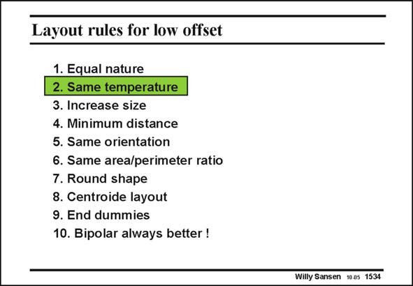

# SANSEN-1534 · Layout rules for low offset

章节：15 失调与共模抑制比：随机误差及系统误差  
PDF 页：430；书本页：438；幻灯片编号：1534  
状态：unreviewed



## 对应教材讲解

### PDF 430 · 书本 438

A second condition for good matching is that both devices must be on the same isotherm. Most large chips operate at high temperatures. Silicon is a good thermal conductor and yet temperature differences are easily generated, for example, power devices operate on one end of the chip and the input transistors of an opamp are on the other side. Such a situation is sketched next.

## 公式／性能结论候选摘录

以下为规则截取的原文，尚未逐项判读。

（未由规则找到；不代表原页没有此类内容。）

## 曲线结论候选摘录

以下为规则截取的原文，尚未逐项判读。

（未由规则找到；不代表原页没有此类内容。）

## 原文条件与近似候选摘录

以下为规则截取的原文，尚未逐项判读。

（未由规则找到；不代表原页没有此类内容。）

## 幻灯片 OCR（未校正）

```text
Layout rules for low offset
1. Equal nature
2. Same temperature
3. Increase size
4. Minimum distance
5. Same orientation
6. Same area/perimeter ratio
7. Round shape
8. Centroide layout
9. End dummies
10. Bipolar always better !
Willy Sansen 1005 1534
```

数学上下标、分数及正负号以原图为准。电路图已保留；未核对的连接不输出成可仿真 netlist。
