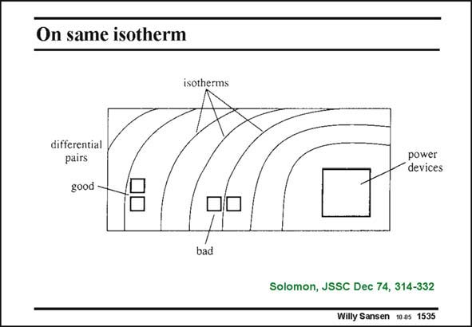

# SANSEN-1535 · On same isotherm

章节：15 失调与共模抑制比：随机误差及系统误差  
PDF 页：430；书本页：438；幻灯片编号：1535  
状态：unreviewed



## 对应教材讲解

### PDF 430 · 书本 438

Power devices are located on the right. They heat up the chip on the right side, generating isotherms on the other side of the chip. The input transistors of an opamp or any other differential circuit is better laid out on this isotherm. If not, an internal thermal resistance is active, which limits the open-loop gain in exactly the same way as a feedback resistor would (see reference). This applies not only to static isotherms but also dynamic ones, for example when power switches (or relays) are integrated on the chip. Temperature gradients can also induce stress in the chip. The same applies to the package. Matched components have to be laid out on iso-stress lines, which may be hard to be identified!

## 公式／性能结论候选摘录

以下为规则截取的原文，尚未逐项判读。

- PDF 430: If not, an internal thermal resistance is active, which limits the open-loop gain in exactly the same way as a feedback resistor would (see reference).

## 曲线结论候选摘录

以下为规则截取的原文，尚未逐项判读。

（未由规则找到；不代表原页没有此类内容。）

## 原文条件与近似候选摘录

以下为规则截取的原文，尚未逐项判读。

（未由规则找到；不代表原页没有此类内容。）

## 幻灯片 OCR（未校正）

```text
On same isotherm
isotherms
differential
pairs
good -
power
devices
bad
Solomon, JSSC Dec 74, 314-332
Willy Sansen 1005 1535
```

数学上下标、分数及正负号以原图为准。电路图已保留；未核对的连接不输出成可仿真 netlist。
