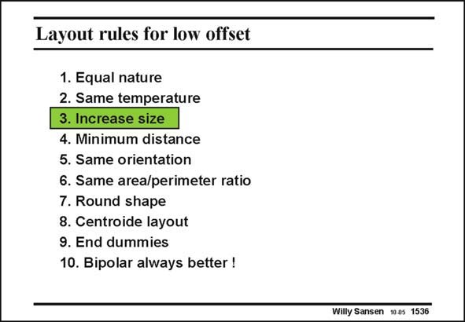

# SANSEN-1536 · Layout rules for low offset

章节：15 失调与共模抑制比：随机误差及系统误差  
PDF 页：431；书本页：439；幻灯片编号：1536  
状态：unreviewed



## 对应教材讲解

### PDF 431 · 书本 439

The most important rule for good matching is to increase the size. Let us first have a look at how size plays for resistors and capacitors. For MOSTs we know already that spreading on V (and the T other parameters) is inversely proportional to the square root of WL. In other words, if both the channel width W and the channel length L are multiplied by 2, then the spreading (delta, sigma) is divided by 2. We will see that this also applies to resistors but not to capacitors.

## 公式／性能结论候选摘录

以下为规则截取的原文，尚未逐项判读。

- PDF 431: The most important rule for good matching is to increase the size.
- PDF 431: For MOSTs we know already that spreading on V (and the T other parameters) is inversely proportional to the square root of WL.

## 曲线结论候选摘录

以下为规则截取的原文，尚未逐项判读。

（未由规则找到；不代表原页没有此类内容。）

## 原文条件与近似候选摘录

以下为规则截取的原文，尚未逐项判读。

（未由规则找到；不代表原页没有此类内容。）

## 幻灯片 OCR（未校正）

```text
Layout rules for low offset
1. Equal nature
2. Same temperature
3. Increase size
4. Minimum distance
5. Same orientation
6. Same area/perimeter ratio
7. Round shape
8. Centroide layout
9. End dummies
10. Bipolar always better !
Willy Sansen 1005 1536
```

数学上下标、分数及正负号以原图为准。电路图已保留；未核对的连接不输出成可仿真 netlist。
