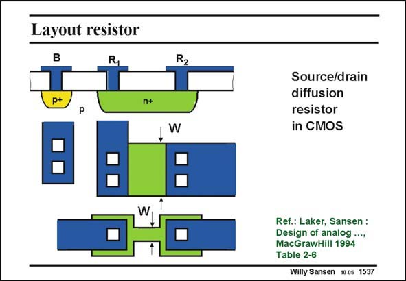

# SANSEN-1537 · Layout resistor

章节：15 失调与共模抑制比：随机误差及系统误差  
PDF 页：431；书本页：439；幻灯片编号：1537  
状态：unreviewed



## 对应教材讲解

### PDF 431 · 书本 439

Resistors are little more than a conductive island contacted at both extremities. Many different resistors can be realized as many different diffused or ion implanted islands can be realized. Some examples are given in this slide. Normally the smaller dimension, which is W in the example at the bottom, determines the matching which can be achieved. In bipolar technologies, several diffusion layers can be identified, such as the ones for the base, for the emitter, for the collector, etc. In CMOS technologies however, the source and drain diffusion is always available. Also the well-diffusion can be used for high-valued resistances. They are all listed next.

## 公式／性能结论候选摘录

以下为规则截取的原文，尚未逐项判读。

（未由规则找到；不代表原页没有此类内容。）

## 曲线结论候选摘录

以下为规则截取的原文，尚未逐项判读。

（未由规则找到；不代表原页没有此类内容。）

## 原文条件与近似候选摘录

以下为规则截取的原文，尚未逐项判读。

（未由规则找到；不代表原页没有此类内容。）

## 幻灯片 OCR（未校正）

```text
Layout resistor
p+
n+
W
Source/drain
diffusion
resistor
in CMOS
Ref.: Laker, Sansen :
Design of analog ...,
MacGrawHill 1994
Table 2-6
Willy Sansen 1005 1537
```

数学上下标、分数及正负号以原图为准。电路图已保留；未核对的连接不输出成可仿真 netlist。
