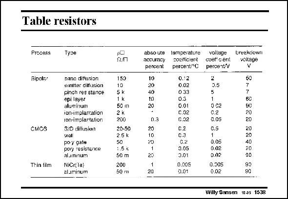

# SANSEN-1538 · Table resistors

章节：15 失调与共模抑制比：随机误差及系统误差  
PDF 页：432；书本页：440；幻灯片编号：1538  
状态：unreviewed



## 对应教材讲解

### PDF 431 · 书本 439

This table lists the most common resistances in both bipolar and CMOS technologies. The sheet resistivities are given, followed by the absolute accuracies and some more specifications. It is clear that in bipolar technologies a wide variety of resistivities is available. The ones with

### PDF 432 · 书本 440

the highest accuracy however, are the ion-implanted ones. They are an addition to a standard process however, and are not always available. In CMOS technologies, the source/drain diffusion yields a resistance of low value which is very imprecise. The well is only a little better. The only precise one is the poly-silicon resistor. Its sigma has an A of about R 0.04 mm. Again, it is an addition to a standard CMOS process and is therefore expensive. It is not available in a digital CMOS process. Thin film resistances can also be added on top of the silicon structure. They are normally realized with Tantalum or Nichrome. They are very precise but mainly used for trimming. Aluminum metallization is less precise by lack of control of its thickness. Copper is now also used.

## 公式／性能结论候选摘录

以下为规则截取的原文，尚未逐项判读。

- PDF 432: Again, it is an addition to a standard CMOS process and is therefore expensive.

## 曲线结论候选摘录

以下为规则截取的原文，尚未逐项判读。

（未由规则找到；不代表原页没有此类内容。）

## 原文条件与近似候选摘录

以下为规则截取的原文，尚未逐项判读。

（未由规则找到；不代表原页没有此类内容。）

## 幻灯片 OCR（未校正）

```text
Table resistors
Precess
Tyse
Bipals/
CMOS
Thin tilm
nase ditusion
emitter ditfusion
pinch res stance
epi layer
aluminum
ion-implaration
ion-implartation
3:0 dillusion
wel
po y gate
pory resistance
aluminum
NiCr(la!
aluminum
150
10
5 k
1 k
50 m
2k
200
20-50
25k
50
1.5 k
50 m
200
50 m
abso ute temperature
accuracy
cocificient
percant
percent*C
10
20
40
10
20
0.3
20
10
20
20
20
0.12
0.02
0 33
0.3
0.01
C.02
0.02
C.2
C.3
0.2
0.05
3.01
0.005
0.01
vollage
cuel' c.ent
percentV
2
3,5
1
0 92
0.2
C.05
0.5
1
0.05
0.02
0.02
0.305
0.02
breakdown
voltage
V
60
60
20
20
20
20
40
20
90
90
90
Willy Sansen 1005 1538
```

数学上下标、分数及正负号以原图为准。电路图已保留；未核对的连接不输出成可仿真 netlist。
