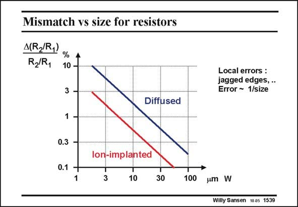

# SANSEN-1539 · Mismatch vs size for resistors

章节：15 失调与共模抑制比：随机误差及系统误差  
PDF 页：432；书本页：440；幻灯片编号：1539  
状态：unreviewed



## 对应教材讲解

### PDF 432 · 书本 440

For resistors, the absolute and relative accuracy decrease with size. Above the relative accuracy is sketched versus linear dimension, for a fixed W/L ratio, in which W is the smaller dimension. This accuracy is about inversely proportional to size, as for MOST devices. This is not surprising at all as MOST devices are actually resistances. The reason for this dependency is that local errors dominate. They have jagged and rounded edges, and many more local deficiencies in the definition of the layout. Also, note that ion implanted resistances are a lot better than diffused ones, because of the higher reproducibility involved. Finally, note that resistances only provide limited accuracy for average sizes. If a minimum dimension is taken to be about 10 mm, then about 0.5% error can be expected. This corresponds to a signal-to-error or signal-to-distortion ratio of about 200 or 46 dB. Divided by 6 this 46 dB

### PDF 433 · 书本 441

yields little over 7 bit. This means that resistive ladders are easy to lay out as more than 7–8 bits accuracy is not required. Many 8 bits ADC’s are still realized in this way (see Chapter 20).

## 公式／性能结论候选摘录

以下为规则截取的原文，尚未逐项判读。

- PDF 432: For resistors, the absolute and relative accuracy decrease with size.
- PDF 432: This accuracy is about inversely proportional to size, as for MOST devices.
- PDF 432: The reason for this dependency is that local errors dominate.
- PDF 432: Finally, note that resistances only provide limited accuracy for average sizes.

## 曲线结论候选摘录

以下为规则截取的原文，尚未逐项判读。

（未由规则找到；不代表原页没有此类内容。）

## 原文条件与近似候选摘录

以下为规则截取的原文，尚未逐项判读。

（未由规则找到；不代表原页没有此类内容。）

## 幻灯片 OCR（未校正）

```text
Mismatch vs size for resistors
A(R/R,)
R2/R,
% 1
3 -
1.
0.3 -
Diffused
lon-implanted
0.1 -
1
3
10
30
100
Local errors :
jagged edges, ..
Error - 1/size
um W
Willy Sansen 1005 1539
```

数学上下标、分数及正负号以原图为准。电路图已保留；未核对的连接不输出成可仿真 netlist。
