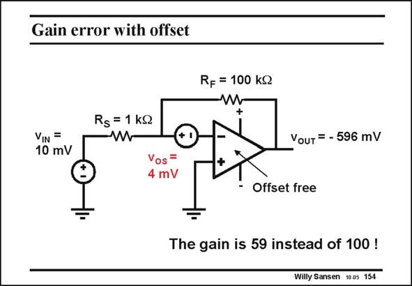

# SANSEN-154 · Gain error with offset

章节：15 失调与共模抑制比：随机误差及系统误差  
PDF 页：414；书本页：422；幻灯片编号：154  
状态：unreviewed



## 对应教材讲解

### PDF 414 · 书本 422

The offset can cause large errors in high-gain opamp configurations. In the example in this slide, a small DC voltage is amplified coming from a thermocouple. A gain of 1000 is expected. For an input voltage this would give an output voltage of −1 V. The output voltage is only −596 mV however. An offset voltage of 4 mV leaves only 6 mV as a voltage across the resistor R . The S voltage across resistor R is F now 100 times higher, which is 600 mV leading to the output voltage shown. This offset causes a large error in gain!

## 公式／性能结论候选摘录

以下为规则截取的原文，尚未逐项判读。

- PDF 414: The offset can cause large errors in high-gain opamp configurations.
- PDF 414: A gain of 1000 is expected.
- PDF 414: This offset causes a large error in gain!

## 曲线结论候选摘录

以下为规则截取的原文，尚未逐项判读。

（未由规则找到；不代表原页没有此类内容。）

## 原文条件与近似候选摘录

以下为规则截取的原文，尚未逐项判读。

（未由规则找到；不代表原页没有此类内容。）

## 幻灯片 OCR（未校正）

```text
Gain error with offset
RF = 100 kQ
Rs = 1 KS
VIN =
10 mV
Vour = - 596 mV
Vos =
4 mV
- Offset free
The gain is 59 instead of 100 !
Willy Sansen 10a5 154
```

数学上下标、分数及正负号以原图为准。电路图已保留；未核对的连接不输出成可仿真 netlist。
