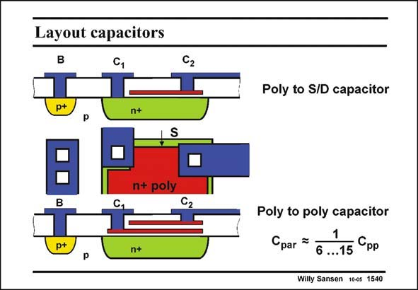

# SANSEN-1540 · Layout capacitors

章节：15 失调与共模抑制比：随机误差及系统误差  
PDF 页：433；书本页：441；幻灯片编号：1540  
状态：unreviewed



## 对应教材讲解

### PDF 433 · 书本 441

Some layouts of capacitances are shown in this slide. The top one is a (n+ doped) poly-to-diffusion capacitance C . It uses the pp Gate oxide as a dielectric. It is not all that attractive as it has a large series resistance in the diffusion layer. Moreover, it has a large parasitic capacitance C par between the diffusion layer and the substrate. A double poly-layer has much less series resistance but still a fair amount of parasitic capacitances. Moreover a double poly-layer is an addition to standard CMOS processing, and is therefore expensive. Nowadays, CMOS processes offer many metal layers on top. Each pair of metal layers can be used as a capacitance. The main criteria are then the reproducibility of the dielectric thickness and the parasitic capacitance to all other layers. A wide choice is now available.

## 公式／性能结论候选摘录

以下为规则截取的原文，尚未逐项判读。

- PDF 433: Moreover a double poly-layer is an addition to standard CMOS processing, and is therefore expensive.

## 曲线结论候选摘录

以下为规则截取的原文，尚未逐项判读。

（未由规则找到；不代表原页没有此类内容。）

## 原文条件与近似候选摘录

以下为规则截取的原文，尚未逐项判读。

（未由规则找到；不代表原页没有此类内容。）

## 幻灯片 OCR（未校正）

```text
Layout capacitors
C,
p+
n+
n+ poly
p+
n+
Poly to S/D capacitor
Poly to poly capacitor
Cpar =
6 ...15
Срр
Willy Sansen 10es 1540
```

数学上下标、分数及正负号以原图为准。电路图已保留；未核对的连接不输出成可仿真 netlist。
