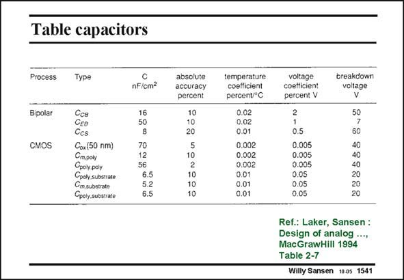

# SANSEN-1541 · Table capacitors

章节：15 失调与共模抑制比：随机误差及系统误差  
PDF 页：433；书本页：441；幻灯片编号：1541  
状态：unreviewed



## 对应教材讲解

### PDF 433 · 书本 441

Some typical values are collected in the Table in this slide. In bipolar technologies all capacitances are junction capacitances. They are heavily voltage dependent. Only CMOS technologies offer good capacitances. The best one is still the Gate oxide capacitance. For a 50 nm oxide thickness (which corresponds to a 2.4 mm CMOS process), the capacitance is quite high. It is even ten times higher for a 0.25 mm CMOS process. Several other capacitances are gives. Do not forget that many more can be added, depending on the number of metal layers available.

## 公式／性能结论候选摘录

以下为规则截取的原文，尚未逐项判读。

- PDF 433: They are heavily voltage dependent.
- PDF 433: Do not forget that many more can be added, depending on the number of metal layers available.

## 曲线结论候选摘录

以下为规则截取的原文，尚未逐项判读。

（未由规则找到；不代表原页没有此类内容。）

## 原文条件与近似候选摘录

以下为规则截取的原文，尚未逐项判读。

（未由规则找到；不代表原页没有此类内容。）

## 幻灯片 OCR（未校正）

```text
Table capacitors
Process
Type
Bipolar
CMOS
Cce
Gee
Ccs
Cox(50 nm)
Crm.pory
Сроlypoly
Goohy, substrate
Cm.substrate
Gpoly substrate
nF/cm/
16
50
70
12
56
6.5
5.2
6.5
absolute
accuracy
percent
temperature
coefficient
percent/°C
0.02
0.02
0.01
0.002
0.002
0.002
0.01
0.01
0.01
voltage
coefficient
percent V
breakdown
voltage
0.5
0.005
0.005
0.005
0.05
0.05
0.05
60
40
40
40
20
20
20
Ref.: Laker, Sansen:
Design of analog ...,
MacGrawHill 1994
Table 2-7
Willy Sansen 1905 1541
```

数学上下标、分数及正负号以原图为准。电路图已保留；未核对的连接不输出成可仿真 netlist。
