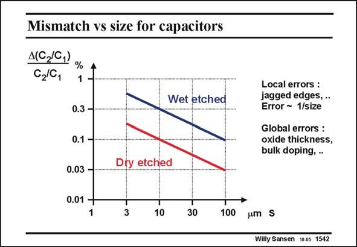

# SANSEN-1542 · Mismatch vs size for capacitors

章节：15 失调与共模抑制比：随机误差及系统误差  
PDF 页：434；书本页：442；幻灯片编号：1542  
状态：unreviewed



## 对应教材讲解

### PDF 434 · 书本 442

The curve of the relative accuracy versus size is not as steep as for resistors but gives smaller values. Parameter S stands for the side of a square capacitor. The slope is about half of the one for resistors. The reason is that now a combination is found of local and global errors. Global errors are related to slowly changing oxide thicknesses from one side of a wafer to the other side, doping levels, under-etching, etc. This combination leads to a lower slope. Note that dry etching defines the capacitors in a better way than wet etching as used before. Note also that capacitors provide higher accuracy than resistors. If square capacitors are taken with a side of 10 mm, then about 0.1% error can be expected. This corresponds to a signal-todistortion ratio of about 1000 or 60 dB. Divided by 6 this 60 dB yields about 10 bit. This means that capacitive ladders can be laid out with 10 bit accuracy. Many 10–12 bits ADC’s are realized in this way (see Chapter 20). For higher values, a very large number of capacitances have to be used, but 14 bit has been reached!

## 公式／性能结论候选摘录

以下为规则截取的原文，尚未逐项判读。

（未由规则找到；不代表原页没有此类内容。）

## 曲线结论候选摘录

以下为规则截取的原文，尚未逐项判读。

- PDF 434: The curve of the relative accuracy versus size is not as steep as for resistors but gives smaller values.
- PDF 434: The slope is about half of the one for resistors.
- PDF 434: This combination leads to a lower slope.

## 原文条件与近似候选摘录

以下为规则截取的原文，尚未逐项判读。

（未由规则找到；不代表原页没有此类内容。）

## 幻灯片 OCR（未校正）

```text
Mismatch vs size for capacitors
A(C,I0,)
C2/0,
Wet etched
0.3 -
0.1 -
0.03 -
0.01 -
1
Dry etched
3
30
100
Local errors :
jagged edges, ..
Error ~ 1/size
Global errors :
oxide thickness,
bulk doping, .
umS
Willy Sansen 10a5 1542
```

数学上下标、分数及正负号以原图为准。电路图已保留；未核对的连接不输出成可仿真 netlist。
