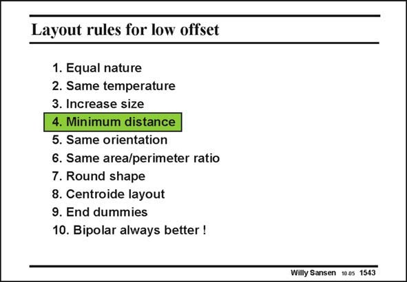

# SANSEN-1543 · Layout rules for low offset

章节：15 失调与共模抑制比：随机误差及系统误差  
PDF 页：434；书本页：442；幻灯片编号：1543  
状态：unreviewed



## 对应教材讲解

### PDF 434 · 书本 442

In addition to size, distance between two devices plays a role, albeit less than in earlier technologies. From the Table with S VT and S , it has become clear WL that the requirement of short distance has been relaxed. Indeed CMOS processing has been carried out on ever increasing wafer sizes, reaching about 12 inch at the moment, but 15 inch wafers are surely being planned. As a result, the processing technologies have become more homogeneous over these large wafers. This is why distance on a short range, does not play the same role as before. Only when large fractions of a chip are being covered, then distance will play a role as explained under point 8 centroide layout. Examples are large capacitance banks aiming at 12–14 bits accuracy.

## 公式／性能结论候选摘录

以下为规则截取的原文，尚未逐项判读。

- PDF 434: As a result, the processing technologies have become more homogeneous over these large wafers.

## 曲线结论候选摘录

以下为规则截取的原文，尚未逐项判读。

（未由规则找到；不代表原页没有此类内容。）

## 原文条件与近似候选摘录

以下为规则截取的原文，尚未逐项判读。

（未由规则找到；不代表原页没有此类内容。）

## 幻灯片 OCR（未校正）

```text
Layout rules for low offset
1. Equal nature
2. Same temperature
3. Increase size
4. Minimum distance
5. Same orientation
6. Same area/perimeter ratio
7. Round shape
8. Centroide layout
9. End dummies
10. Bipolar always better !
Willy Sansen 10a5 1543
```

数学上下标、分数及正负号以原图为准。电路图已保留；未核对的连接不输出成可仿真 netlist。
