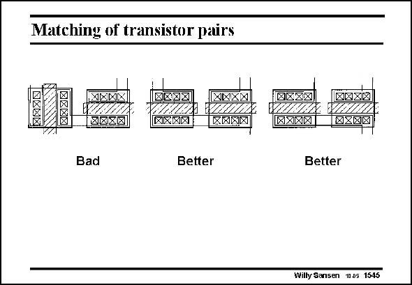

# SANSEN-1545 · Matching of transistor pairs

章节：15 失调与共模抑制比：随机误差及系统误差  
PDF 页：435；书本页：443；幻灯片编号：1545  
状态：unreviewed



## 对应教材讲解

### PDF 435 · 书本 443

In the first example, the direction of the current in the left transistor is perpendicular to the direction of the current in the second transistor. This is indeed bad for matching. The other two examples are better ones. The actual positioning of the connections may cause some minor difference in Source contact resistance, but this is not that evident.

## 公式／性能结论候选摘录

以下为规则截取的原文，尚未逐项判读。

（未由规则找到；不代表原页没有此类内容。）

## 曲线结论候选摘录

以下为规则截取的原文，尚未逐项判读。

（未由规则找到；不代表原页没有此类内容。）

## 原文条件与近似候选摘录

以下为规则截取的原文，尚未逐项判读。

（未由规则找到；不代表原页没有此类内容。）

## 幻灯片 OCR（未校正）

```text
Matching of transistor pairs
IMANXI
1ETAALA,
8020
TBA0A
NXNX
RXXAI
mhiie
XANE
Bad
Better
(0xX/X1]
DVIEII.!!
NXXNI
ANXN]
SIHRIL
Better
Willy Sansen 1005 1545
```

数学上下标、分数及正负号以原图为准。电路图已保留；未核对的连接不输出成可仿真 netlist。
