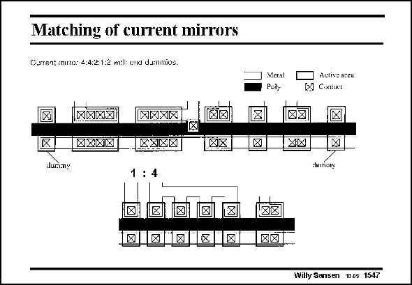

# SANSEN-1547 · Matching of current mirrors

章节：15 失调与共模抑制比：随机误差及系统误差  
PDF 页：436；书本页：444；幻灯片编号：1547  
状态：unreviewed



## 对应教材讲解

### PDF 436 · 书本 444

A number of matched transistors is shown for a current mirror with multiple outputs. The relative transistor sizes are 4: 4: 2: 1: 2, when the first and last dummy transistors are excluded. The second transistor with relative size 4 is connected as a diode indeed. These ratios won’t be very accurate however. The rounding of the corners for a transistor with size 4, is relatively speaking, much less important than the same rounding for a transistor with size 1. A better solution is to use the same shapes for all transistors and to connect them in parallel, as shown below. This 1:4 ratio will be much more accurate as local errors all have the same relative influence: their area to perimeter ratio is always the same. This is a typical bipolar transistor layout style. More space is evidently required but we know already that more space leads to better matching. Even better would be to lay out the single transistor in the middle of the four transistors, so that they have the same point of gravity, as explained in point 8 on the centroide layout.

## 公式／性能结论候选摘录

以下为规则截取的原文，尚未逐项判读。

（未由规则找到；不代表原页没有此类内容。）

## 曲线结论候选摘录

以下为规则截取的原文，尚未逐项判读。

（未由规则找到；不代表原页没有此类内容。）

## 原文条件与近似候选摘录

以下为规则截取的原文，尚未逐项判读。

（未由规则找到；不代表原页没有此类内容。）

## 幻灯片 OCR（未校正）

```text
Matching of current mirrors
Current imirro: 4:4:2:1:2 wil: ena dammios.
Meral
Paly
Active azeu
Contact
MAXX
KXNIX
MXXIX
XX
dummy
tummy
Willy Sansen 1005 1547
```

数学上下标、分数及正负号以原图为准。电路图已保留；未核对的连接不输出成可仿真 netlist。
