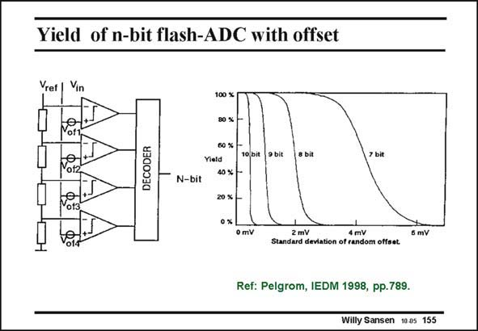

# SANSEN-155 · Yield of n-bit flash-ADC with offset

章节：15 失调与共模抑制比：随机误差及系统误差  
PDF 页：415；书本页：423；幻灯片编号：155  
状态：unreviewed



## 对应教材讲解

### PDF 414 · 书本 422

This offset causes an error in this ADC (analog-to-digital converter) as well. In this flash converter, the input voltage V is compared with a voltage which is divided from a reference voltage V . in ref The comparators indicate at which tap of the reference voltage the input voltage is located.

### PDF 415 · 书本 423

Obviously, when these comparators have an offset voltage they may give an erroneous result. The yield of such an ADC will depend on the offsets present. The graph on the right shows that an 8-bit ADC can be expected to provide a yield of only 60%, if the offset is about 2 mV. As a consequence, the offset severely limits the resolution of the ADC’s if a high yield is required, which is usually the case!

## 公式／性能结论候选摘录

以下为规则截取的原文，尚未逐项判读。

- PDF 415: The yield of such an ADC will depend on the offsets present.
- PDF 415: As a consequence, the offset severely limits the resolution of the ADC’s if a high yield is required, which is usually the case!

## 曲线结论候选摘录

以下为规则截取的原文，尚未逐项判读。

（未由规则找到；不代表原页没有此类内容。）

## 原文条件与近似候选摘录

以下为规则截取的原文，尚未逐项判读。

（未由规则找到；不代表原页没有此类内容。）

## 幻灯片 OCR（未校正）

```text
Yield of n-bit flash-ADC with offset
Vref |
Vin
100 %
of1
DECODER
60 %
Yield
40 % +-
10 bit
9 bit
8 bit
7 bit
N-bit
20 %
0%
0 mV
2 mV
4 mV
Standard deviation of random offset.
5 mV
Ref: Pelgrom, IEDM 1998, pp.789.
Willy Sansen 1005 155
```

数学上下标、分数及正负号以原图为准。电路图已保留；未核对的连接不输出成可仿真 netlist。
