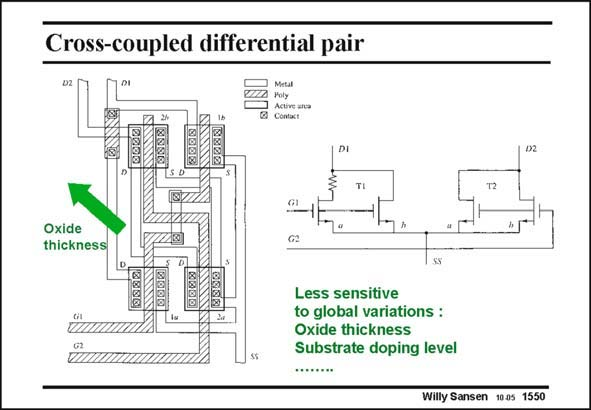

# SANSEN-1550 · Cross-coupled differential pair

章节：15 失调与共模抑制比：随机误差及系统误差  
PDF 页：438；书本页：446；幻灯片编号：1550  
状态：unreviewed



## 对应教材讲解

### PDF 438 · 书本 446

The layout is shown of a differential pair, each transistor of which consists of two equal transistors, connected in parallel but laid out in opposite corners. As a result, the effects of global changes, for example, in oxide thickness, are averaged out. For example, MOST 2b has the lowest K∞ but MOST 2a the highest one. Putting them in parallel gives an average value for K∞ which is about the same as for MOSTs 1a and 1b. Care must be take however, not to insert additional resistances in the Source connections, to connect the transistor terminals. Judicious use of the two or more layers of interconnect is thus mandatory.

## 公式／性能结论候选摘录

以下为规则截取的原文，尚未逐项判读。

- PDF 438: The layout is shown of a differential pair, each transistor of which consists of two equal transistors, connected in parallel but laid out in opposite corners.
- PDF 438: As a result, the effects of global changes, for example, in oxide thickness, are averaged out.
- PDF 438: Judicious use of the two or more layers of interconnect is thus mandatory.

## 曲线结论候选摘录

以下为规则截取的原文，尚未逐项判读。

（未由规则找到；不代表原页没有此类内容。）

## 原文条件与近似候选摘录

以下为规则截取的原文，尚未逐项判读。

（未由规则找到；不代表原页没有此类内容。）

## 幻灯片 OCR（未校正）

```text
Cross-coupled differential pair
Cone
DI
Oxide
thickness
йитит.
Less sensitive
to global variations :
Oxide thickness
Substrate doping level
Willy Sansen 1005 1550
```

数学上下标、分数及正负号以原图为准。电路图已保留；未核对的连接不输出成可仿真 netlist。
