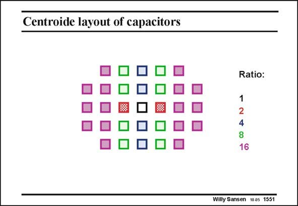

# SANSEN-1551 · Centroide layout of capacitors

章节：15 失调与共模抑制比：随机误差及系统误差  
PDF 页：438；书本页：446；幻灯片编号：1551  
状态：unreviewed



## 对应教材讲解

### PDF 438 · 书本 446

Another example of centroide layout with capacitors is shown in this slide. A capacitance bank is made with ratios 1:2:4:8:16, etc. The unit capacitor is in the middle. The two capacitors are on both sides. They are connected in parallel. The four capacitors are on either end as well. The eight capacitors have as a point of gravity the unit capacitor in the middle, etc. In this way global errors are averaged out. For a large capacitance bank, a large number of unit-capacitors have to be put in parallel, on either side of the unit capacitor in the middle. At this point it is better to lay out all the unitcapacitors randomly distributed over the whole area. In this way 14 accuracy has been obtained (Van der Plas, JSSC Dec. 99, 1708–1718).

## 公式／性能结论候选摘录

以下为规则截取的原文，尚未逐项判读。

（未由规则找到；不代表原页没有此类内容。）

## 曲线结论候选摘录

以下为规则截取的原文，尚未逐项判读。

（未由规则找到；不代表原页没有此类内容。）

## 原文条件与近似候选摘录

以下为规则截取的原文，尚未逐项判读。

（未由规则找到；不代表原页没有此类内容。）

## 幻灯片 OCR（未校正）

```text
Centroide layout of capacitors
Ratio:
1
2
4
8
16
Willy Sansen 1005 1551
```

数学上下标、分数及正负号以原图为准。电路图已保留；未核对的连接不输出成可仿真 netlist。
