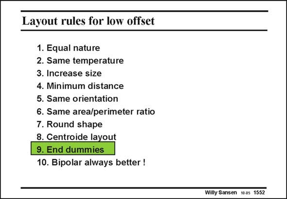

# SANSEN-1552 · Layout rules for low offset

章节：15 失调与共模抑制比：随机误差及系统误差  
PDF 页：439；书本页：447；幻灯片编号：1552  
状态：unreviewed



## 对应教材讲解

### PDF 439 · 书本 447

In a series of equal structures, the first and last ones never quite match. The reason is that the first and last ones see different neighbors. The effects of processing steps such as underetching, contact holes, etc. will be different. This is why dummy transistors (or capacitors) have to be added at the beginning and at the end. They are not used. They are dummies. This is illustrated next.

## 公式／性能结论候选摘录

以下为规则截取的原文，尚未逐项判读。

- PDF 439: In a series of equal structures, the first and last ones never quite match.

## 曲线结论候选摘录

以下为规则截取的原文，尚未逐项判读。

（未由规则找到；不代表原页没有此类内容。）

## 原文条件与近似候选摘录

以下为规则截取的原文，尚未逐项判读。

（未由规则找到；不代表原页没有此类内容。）

## 幻灯片 OCR（未校正）

```text
Layout rules for low offset
1. Equal nature
2. Same temperature
3. Increase size
4. Minimum distance
5. Same orientation
6. Same area/perimeter ratio
7. Round shape
8. Centroide layout
9. End dummies
10. Bipolar always better !
Willy Sansen 1005 1552
```

数学上下标、分数及正负号以原图为准。电路图已保留；未核对的连接不输出成可仿真 netlist。
