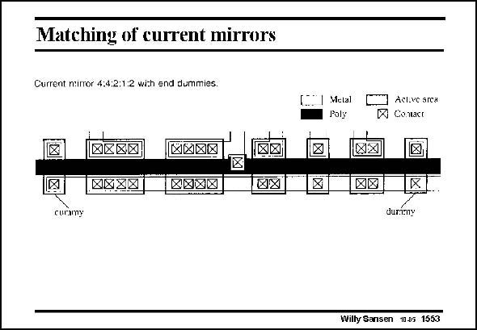

# SANSEN-1553 · Matching of eurrent mirrors

章节：15 失调与共模抑制比：随机误差及系统误差  
PDF 页：439；书本页：447；幻灯片编号：1553  
状态：unreviewed



## 对应教材讲解

### PDF 439 · 书本 447

In this series of transistors, which form a multiple current mirror, the first and last transistors are not connected. They are dummies. They are only present to make sure that the processing is more homogeneous for all the other transistors in between.

## 公式／性能结论候选摘录

以下为规则截取的原文，尚未逐项判读。

（未由规则找到；不代表原页没有此类内容。）

## 曲线结论候选摘录

以下为规则截取的原文，尚未逐项判读。

（未由规则找到；不代表原页没有此类内容。）

## 原文条件与近似候选摘录

以下为规则截取的原文，尚未逐项判读。

（未由规则找到；不代表原页没有此类内容。）

## 幻灯片 OCR（未校正）

```text
Matching of eurrent mirrors
Current ntirror 4:4:2:1:2 with end dummies.
AXXA
MX
Cueayy
Metal
Poly
Aclive arca
Contact
durimy
Willy Sansen 1005 1553
```

数学上下标、分数及正负号以原图为准。电路图已保留；未核对的连接不输出成可仿真 netlist。
