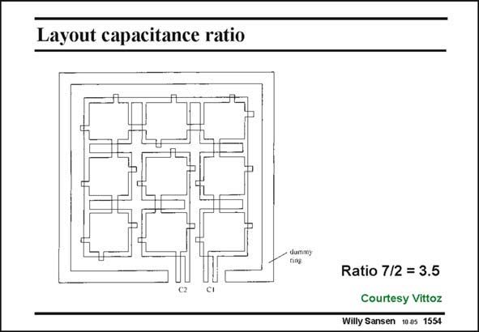

# SANSEN-1554 · Layout capacitance ratio

章节：15 失调与共模抑制比：随机误差及系统误差  
PDF 页：440；书本页：448；幻灯片编号：1554  
状态：unreviewed



## 对应教材讲解

### PDF 440 · 书本 448

A good example of a layout in which all rules are properly applied is shown in this slide. It consists of nine equal capacitors, to which tabs have been added. These tabs are used to connect some of the capacitors. In this way a ratio of 7/2 is realized. All tabs are always present even if they are not used. In this way the parasitic capacitances associated with the four tabs are always the same. All unit capacitances have the same shape: they have the same area/perimeter ratio. Moreover, they are laid out in centroide form. The two capacitors are in the middle, surrounded by the seven other ones. They have about the same point of gravity. Finally, the whole structure is surrounded by a dummy ring to make sure that all capacitors see the same neighbors.

## 公式／性能结论候选摘录

以下为规则截取的原文，尚未逐项判读。

- PDF 440: It consists of nine equal capacitors, to which tabs have been added.

## 曲线结论候选摘录

以下为规则截取的原文，尚未逐项判读。

（未由规则找到；不代表原页没有此类内容。）

## 原文条件与近似候选摘录

以下为规则截取的原文，尚未逐项判读。

（未由规则找到；不代表原页没有此类内容。）

## 幻灯片 OCR（未校正）

```text
Layout capacitance ratio
Ratio 7/2 = 3.5
Courtesy Vittoz
Willy Sansen 1005 1554
```

数学上下标、分数及正负号以原图为准。电路图已保留；未核对的连接不输出成可仿真 netlist。
