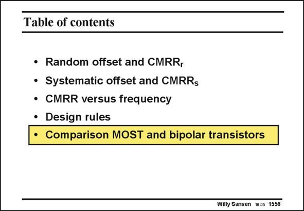

# SANSEN-1556 · Table of contents

章节：15 失调与共模抑制比：随机误差及系统误差  
PDF 页：441；书本页：449；幻灯片编号：1556  
状态：unreviewed



## 对应教材讲解

### PDF 441 · 书本 449

Comparison of the models of MOST and bipolar technologies show that MOSTs are actually modulated resistances, whereas bipolar transistors employ a forward biased diode as an input. A bipolar transistor does not have a threshold voltage V and always has T an exponential I /V rela- CE BE tionship. Its current is a small current I multiplied S by the voltage V , scaled BE by kT/q. This is worked out further next.

## 公式／性能结论候选摘录

以下为规则截取的原文，尚未逐项判读。

（未由规则找到；不代表原页没有此类内容。）

## 曲线结论候选摘录

以下为规则截取的原文，尚未逐项判读。

（未由规则找到；不代表原页没有此类内容。）

## 原文条件与近似候选摘录

以下为规则截取的原文，尚未逐项判读。

（未由规则找到；不代表原页没有此类内容。）

## 幻灯片 OCR（未校正）

```text
Table of contents
• Random offset and CMRR,
• Systematic offset and CMRRs
• CMRR versus frequency
• Design rules
•
Comparison MOST and bipolar transistors
Willy Sansen 10a5 1556
```

数学上下标、分数及正负号以原图为准。电路图已保留；未核对的连接不输出成可仿真 netlist。
