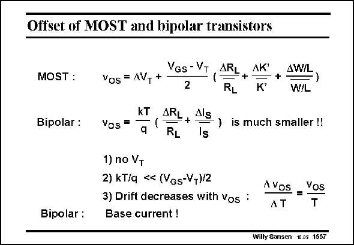

# SANSEN-1557 · Offset of MOST and bipolar transistors

章节：15 失调与共模抑制比：随机误差及系统误差  
PDF 页：441；书本页：449；幻灯片编号：1557  
状态：unreviewed



## 对应教材讲解

### PDF 441 · 书本 449

Indeed, the expression of the offset of a bipolar transistor does not include the effect of the spreading of threshold voltage V . Moreover the T scaling factor by which parameters such as DR /R , L L etc. come in is only kT/q, whereas it is (V −V )/2 GS T for a MOST. These are two important reasons why the offset voltage v for a bipolar is so os much smaller. Moreover, the drift of the offset voltage v with temos perature is well controlled. The derivative of v to T is the absolute value of v divided by T. os os Trimming the offset voltage v to a small value at the same time reduces the drift with os temperature. This is not at all true for MOSTs, in which there is no relationship between offset and offset drift. As a result, a bipolar transistor is an excellent choice for high-temperature applications, where a low offset is required. If MOSTs have to be used, they will have to be supplemented by offset cancellation circuitry, carrying out chopping or auto-zeroing (Ref. Enz, Temes, Proc. IEEE, Nov. 96, 1584–1614). The main problem of bipolars, on the other hand, is that they have base currents. This is discussed next.

## 公式／性能结论候选摘录

以下为规则截取的原文，尚未逐项判读。

- PDF 441: As a result, a bipolar transistor is an excellent choice for high-temperature applications, where a low offset is required.

## 曲线结论候选摘录

以下为规则截取的原文，尚未逐项判读。

（未由规则找到；不代表原页没有此类内容。）

## 原文条件与近似候选摘录

以下为规则截取的原文，尚未逐项判读。

- PDF 441: These are two important reasons why the offset voltage v for a bipolar is so os much smaller.

## 幻灯片 OCR（未校正）

```text
Offset of MOST and bipolar transistors
MOST :
Bipolar :
VGs - VT
Vos = AV, +
2
ARL+
AK
RL
K*
AW/L
+-
)
W/L
Vos =
kT
q
ARL
Als
+
RL
Is
)
is much smaller !!
1) no VT
2) kT/q < (VGs-V+)/2
3) Drift decreases with vos :
Bipolar : Base current !
A Vos
AT
Vos
T
Willy Sansen 10.05 1557
```

数学上下标、分数及正负号以原图为准。电路图已保留；未核对的连接不输出成可仿真 netlist。
