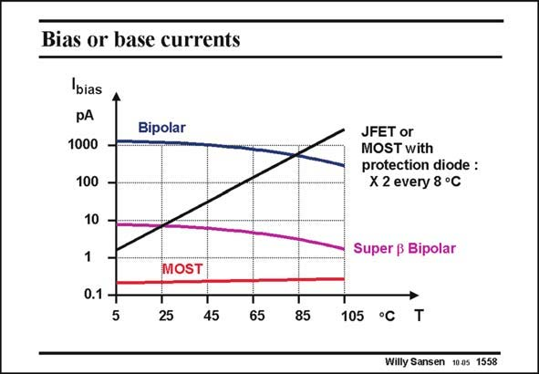

# SANSEN-1558 · Bias or base currents

章节：15 失调与共模抑制比：随机误差及系统误差  
PDF 页：442；书本页：450；幻灯片编号：1558  
状态：unreviewed



## 对应教材讲解

### PDF 442 · 书本 450

The base currents in bipolar transistors can be quite high. Shown in this slide are the input currents for a number of opamps in which the input devices are realized in different technologies. The currents in conventional bipolar opamps are of the mA level. Their base currents are therefore of the nA level. Since the beta increases with temperature, the base currents decrease with temperature, which is clearly an advantage in power applications. These base currents can be decreased even further by use of super-beta devices. They have beta values above 3000. As a result, the base currents are smaller. On the other hand, they cannot take collector voltages above a few Volts. MOSTs have the lowest input currents, at least if they do not have a protection device. Such device includes some diodes, which have a leakage current which increases drastically with temperature (×2 every 8 degrees). This is similar to a Junction-FET. A conventional bipolar transistor has the highest base current. Circuit techniques can be devised to compensate these currents. Some of them are discussed next.

## 公式／性能结论候选摘录

以下为规则截取的原文，尚未逐项判读。

- PDF 442: Their base currents are therefore of the nA level.
- PDF 442: Since the beta increases with temperature, the base currents decrease with temperature, which is clearly an advantage in power applications.
- PDF 442: These base currents can be decreased even further by use of super-beta devices.
- PDF 442: As a result, the base currents are smaller.
- PDF 442: Such device includes some diodes, which have a leakage current which increases drastically with temperature (×2 every 8 degrees).

## 曲线结论候选摘录

以下为规则截取的原文，尚未逐项判读。

（未由规则找到；不代表原页没有此类内容。）

## 原文条件与近似候选摘录

以下为规则截取的原文，尚未逐项判读。

（未由规则找到；不代表原页没有此类内容。）

## 幻灯片 OCR（未校正）

```text
Bias or base currents
bias
Bipolar
1000
100
10
1
0.1 +
5
JFET or
MOST with
protection diode :
X 2 every 8 °C
Super ß Bipolar
MOST
25
45
85
105 °C
Willy Sansen 1005 1558
```

数学上下标、分数及正负号以原图为准。电路图已保留；未核对的连接不输出成可仿真 netlist。
