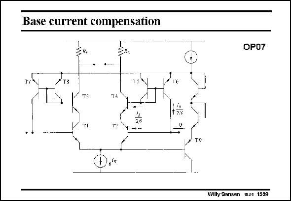

# SANSEN-1559 · Base current compensation

章节：15 失调与共模抑制比：随机误差及系统误差  
PDF 页：442；书本页：450；幻灯片编号：1559  
状态：unreviewed



## 对应教材讲解

### PDF 442 · 书本 450

An older solution to provide input current compensation is shown in this slide. We rely on the matching between transistors T1 and T3. In this case their base currents can be expected to be about the same. A current mirror senses the current into the base of transistor T3 and injects the same current into the base of transistor T1. A voltage clamp is present between the emitters of transistors T5–8 and the emitters of the input transistors T1,2. As a result the collector-emitter voltage across the input transistors T1,2 never exceeds about 0.7 V. Super-beta devices can now be used for T1,2. The base currents are compensated by this additional circuitry. No current is required exter-

### PDF 443 · 书本 451

nally. In practice, there is always some input current flowing, depending on mismatching between T1 and T2 and between T7 an T8. The main disadvantage of this circuit however, is that two different base current cancellation circuits are used on either side of the differential pair. The noise of these additional circuits is now injected at the input terminals. The noise performance is poor.

## 公式／性能结论候选摘录

以下为规则截取的原文，尚未逐项判读。

- PDF 442: As a result the collector-emitter voltage across the input transistors T1,2 never exceeds about 0.7 V.
- PDF 443: In practice, there is always some input current flowing, depending on mismatching between T1 and T2 and between T7 an T8.

## 曲线结论候选摘录

以下为规则截取的原文，尚未逐项判读。

（未由规则找到；不代表原页没有此类内容。）

## 原文条件与近似候选摘录

以下为规则截取的原文，尚未逐项判读。

（未由规则找到；不代表原页没有此类内容。）

## 幻灯片 OCR（未校正）

```text
Base current compensation
OP07
T$
T3
14
taa
TI
T2
Willy Sansen 1005 1559
```

数学上下标、分数及正负号以原图为准。电路图已保留；未核对的连接不输出成可仿真 netlist。
