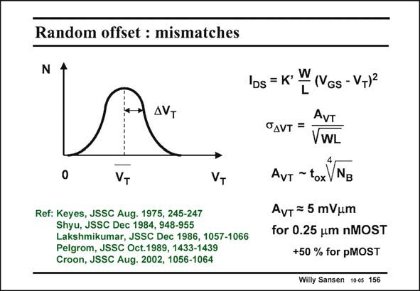

# SANSEN-156 · Random offset : mismatches

章节：15 失调与共模抑制比：随机误差及系统误差  
PDF 页：415；书本页：423；幻灯片编号：156  
状态：unreviewed



## 对应教材讲解

### PDF 415 · 书本 423

This offset is caused by mismatches between transistors which have been laid out equal. When a large number such as 10,000 equal transistors are evaluated, their threshold voltage V are T measured, and their K∞ values, etc. When the number of transistors are plotted versus the actual V T values, a diagram is obtained as shown in this slide. Normally, it shows a Gaussian distribution with an average and a spreading or sigma. For a Gaussian distribution, only about 0.5% of the transistors have a V more than three sigma’s away from the average. T Several models have shown that this sigma is inversely proportional to the square root of the area WL of the transistor. The proportionality constant A on itself, depends on the technology VT used. For smaller channel lengths L, the oxide thickness t (#L/50) decreases but the doping ox levels increase. Parameter N is the doping level of the substrate underneath the transistor. For B a nMOST in 0.5 mm CMOS, A is about 10 mVmm. For a MOST of 20×0.13 mm the sigma VT would be about 6.2 mV. For a pMOST, the A is about 50% higher, mainly because of the higher substrate doping VT level in a n-well CMOS technology.

## 公式／性能结论候选摘录

以下为规则截取的原文，尚未逐项判读。

- PDF 415: This offset is caused by mismatches between transistors which have been laid out equal.
- PDF 415: When a large number such as 10,000 equal transistors are evaluated, their threshold voltage V are T measured, and their K∞ values, etc.
- PDF 415: T Several models have shown that this sigma is inversely proportional to the square root of the area WL of the transistor.
- PDF 415: The proportionality constant A on itself, depends on the technology VT used.
- PDF 415: For smaller channel lengths L, the oxide thickness t (#L/50) decreases but the doping ox levels increase.

## 曲线结论候选摘录

以下为规则截取的原文，尚未逐项判读。

- PDF 415: When the number of transistors are plotted versus the actual V T values, a diagram is obtained as shown in this slide.

## 原文条件与近似候选摘录

以下为规则截取的原文，尚未逐项判读。

（未由规则找到；不代表原页没有此类内容。）

## 幻灯片 OCR（未校正）

```text
Random offset : mismatches
N
AVT
VT
VT
Ref: Keyes, JSSC Aug. 1975, 245-247
Shyu, JSSC Dec 1984, 948-955
Lakshmikumar, JSSC Dec 1986, 1057-1066
Pelgrom, JSSC Oct.1989, 1433-1439
Croon, JSSC Aug. 2002, 1056-1064
'Ds = K'
W
L
(VGs - VT)2
AVT
OAVT =
VWL
AvT-toxVNB
AvT = 5 mVum
for 0.25 um nMOST
+50 % for pMOST
Willy Sansen 1005 156
```

数学上下标、分数及正负号以原图为准。电路图已保留；未核对的连接不输出成可仿真 netlist。
