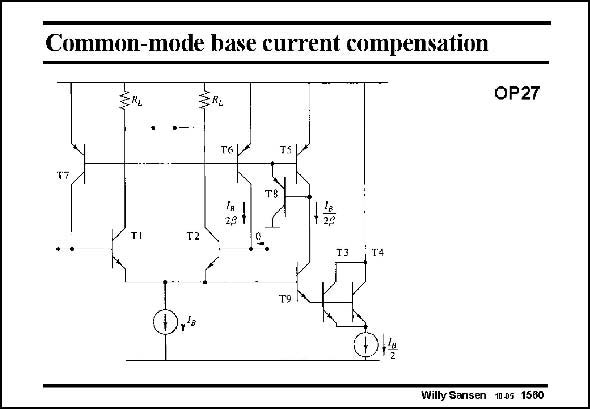

# SANSEN-1560 · Common-mode base current compensation

章节：15 失调与共模抑制比：随机误差及系统误差  
PDF 页：443；书本页：451；幻灯片编号：1560  
状态：unreviewed



## 对应教材讲解

### PDF 443 · 书本 451

A better solution is to construct one common current generator and apply it to both input terminals. The noise generated by this block then cancels out at the differential output. This is illustrated in this slide. We rely on the matching between transistors T1,2 and T3,4. The base current is sensed of the latter ones by cascode transistor T9, mirrored by transistors T5–8 and injected into the input bases. The noise is now generated by all transistors T3–5 and T8–9 and is cancelled out at the differential output. Only the noise by transistors T6 and T7 is still differential and thus injected in the signal path.

## 公式／性能结论候选摘录

以下为规则截取的原文，尚未逐项判读。

- PDF 443: Only the noise by transistors T6 and T7 is still differential and thus injected in the signal path.

## 曲线结论候选摘录

以下为规则截取的原文，尚未逐项判读。

（未由规则找到；不代表原页没有此类内容。）

## 原文条件与近似候选摘录

以下为规则截取的原文，尚未逐项判读。

（未由规则找到；不代表原页没有此类内容。）

## 幻灯片 OCR（未校正）

```text
Common-mode base current compensation
OP27
T50*
TI
2,9
Т 29
T2
T9
ly'o
Willy Sansen 1005 1560
```

数学上下标、分数及正负号以原图为准。电路图已保留；未核对的连接不输出成可仿真 netlist。
