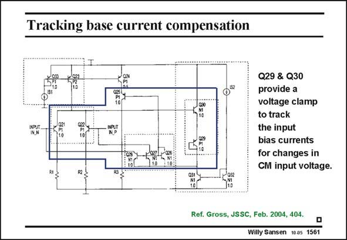

# SANSEN-1561 · Tracking base current compensation

章节：15 失调与共模抑制比：随机误差及系统误差  
PDF 页：443；书本页：451；幻灯片编号：1561  
状态：unreviewed



## 对应教材讲解

### PDF 443 · 书本 451

In order to realize a more precise compensation of the base currents, a more accurate current mirror is required. This means that the transistors which carry out the current mirroring must have the same currents, the same beta’s and the same collector-emitter voltages v . This latter CE requirement is fulfilled in the circuit in this slide. The actual current compensation is realized if the input transistors Q21,22 are matched to transistor Q25. Its base current is mirrored by current mirror Q26–28 and fed to the input transistor bases.

### PDF 444 · 书本 452

In order to ensure that v equals the input v , a voltage clamp of about 1.4 V (or 2 CE25 CE21,22 V ) is introduced with transistors Q29,30. This clamp (or bootstrap circuit) senses the common- BEon mode input voltage at the Sources of the input transistors Q21,22 and keeps the Sources of the current mirror transistors Q26–28 at a constant 0.7 V (or V ) below the common-mode input BEon voltage. As result, all the transistors within this bootstrap loop (blue frame) follow the commonmode input voltage. The base of Q25 is therefore always the same voltage as the average (or common-mode) input voltage. Its collector current is also the same as for transistors Q21,22 and also its v , because CE of equal resistors R1–3.

## 公式／性能结论候选摘录

以下为规则截取的原文，尚未逐项判读。

- PDF 444: In order to ensure that v equals the input v , a voltage clamp of about 1.4 V (or 2 CE25 CE21,22 V ) is introduced with transistors Q29,30.
- PDF 444: The base of Q25 is therefore always the same voltage as the average (or common-mode) input voltage.
- PDF 444: Its collector current is also the same as for transistors Q21,22 and also its v , because CE of equal resistors R1–3.

## 曲线结论候选摘录

以下为规则截取的原文，尚未逐项判读。

（未由规则找到；不代表原页没有此类内容。）

## 原文条件与近似候选摘录

以下为规则截取的原文，尚未逐项判读。

（未由规则找到；不代表原页没有此类内容。）

## 幻灯片 OCR（未校正）

```text
Tracking base current compensation
/024
Q29 & Q30
provide a
voltage clamp
to track
the input
bias currents
for changes in
CM input voltage.
Ref. Gross, JSSC, Feb. 2004, 404.
Willy Sansen 1005 1561
```

数学上下标、分数及正负号以原图为准。电路图已保留；未核对的连接不输出成可仿真 netlist。
