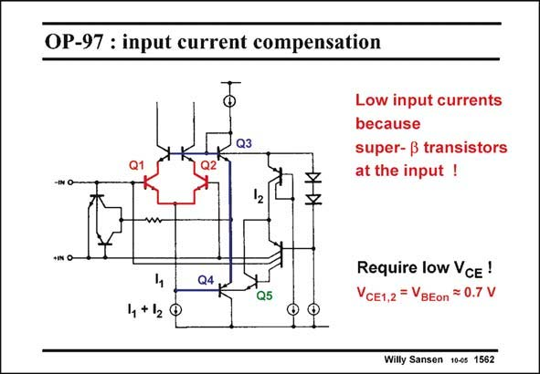

# SANSEN-1562 · OP-97 : input current compensation

章节：15 失调与共模抑制比：随机误差及系统误差  
PDF 页：444；书本页：452；幻灯片编号：1562  
状态：unreviewed



## 对应教材讲解

### PDF 444 · 书本 452

A similar voltage clamp is used in the circuit in this slide. Transistors Q3 and Q4 maintain a 0.7 V voltage drop across the input transistors Q1,2. These devices are normally super-beta transistors. Their v ’s must CE therefore be small indeed. Their base currents are drawn from a current mirror, which derives its input current from the base of transistor Q5. This transistor must therefore be well matched to the input devices. Indeed, it is the same as for the input devices. Its current is also the same. The actual currents are shown on the next slide.

## 公式／性能结论候选摘录

以下为规则截取的原文，尚未逐项判读。

- PDF 444: Their v ’s must CE therefore be small indeed.
- PDF 444: This transistor must therefore be well matched to the input devices.

## 曲线结论候选摘录

以下为规则截取的原文，尚未逐项判读。

（未由规则找到；不代表原页没有此类内容。）

## 原文条件与近似候选摘录

以下为规则截取的原文，尚未逐项判读。

（未由规则找到；不代表原页没有此类内容。）

## 幻灯片 OCR（未校正）

```text
OP-97 : input current compensation
Q3
•1
Q2
Low input currents
because
super- ß transistors
at the input !
12
w
+N O-
Q4
Q5
4 +12
Require low VcE !
VCE1,2 = VBEon = 0.7 V
Willy Sansen 10es 1562
```

数学上下标、分数及正负号以原图为准。电路图已保留；未核对的连接不输出成可仿真 netlist。
