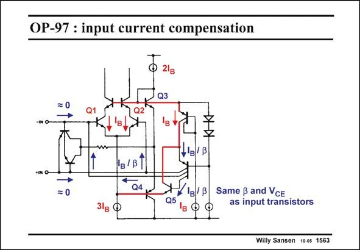

# SANSEN-1563 · OP-97 : input current compensation

章节：15 失调与共模抑制比：随机误差及系统误差  
PDF 页：444；书本页：452；幻灯片编号：1563  
状态：unreviewed



## 对应教材讲解

### PDF 444 · 书本 452

All relevant currents are indicated. The DC current in one single input transistor Q1 (or Q2) is denoted by I . B As a result, the DC currents in all transistors are I as B well. The base current of transistor Q5 is now I /b, B and so are the currents sent to the bases of the input transistors. The external input currents will therefore be close to zero.

## 公式／性能结论候选摘录

以下为规则截取的原文，尚未逐项判读。

- PDF 444: B As a result, the DC currents in all transistors are I as B well.
- PDF 444: The external input currents will therefore be close to zero.

## 曲线结论候选摘录

以下为规则截取的原文，尚未逐项判读。

（未由规则找到；不代表原页没有此类内容。）

## 原文条件与近似候选摘录

以下为规则截取的原文，尚未逐项判读。

（未由规则找到；不代表原页没有此类内容。）

## 幻灯片 OCR（未校正）

```text
OP-97 : input current compensation
Q3
= 0
Q2
'в
V'в'B
+IN O-
= 0
*в/ B 1
Q4
Q5
Same ß and VcE
as input transistors
Willy Sansen 1005 1563
```

数学上下标、分数及正负号以原图为准。电路图已保留；未核对的连接不输出成可仿真 netlist。
