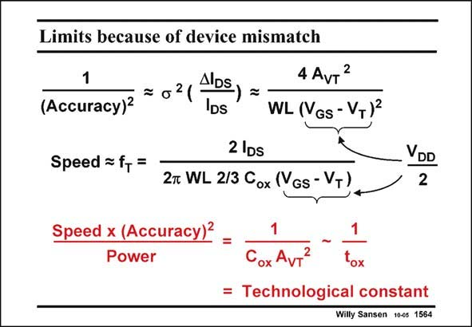

# SANSEN-1564 · Limits because of device mismatch

章节：15 失调与共模抑制比：随机误差及系统误差  
PDF 页：445；书本页：453；幻灯片编号：1564  
状态：unreviewed



## 对应教材讲解

### PDF 445 · 书本 453

It is clear from this slide that mismatch has become the main limitation to the Dynamic Range that can be obtained at a specific frequency and a specific power level. If the accuracy is limited by the spreading on the threshold voltage only, then it can be described approximately by the top expression. Moreover, the speed is related to the f of the tran- T sistor, which has been derived in Chapter 1. As a result, the Speed Accuracy product for a specific amount of power consumption is determined by factors which are constant within a specific CMOS technology. Within the same technology it is not possible to go beyond a certain signal-to-distortion ratio for a certain speed and power consumption. It is assumed that this distortion is set by mismatch. Moreover, as A is proportional to the oxide thickness, this product improves for deeper VT submicron or nanometer CMOS. Obviously, this is somehow to be expected! This means that nanometer CMOS is able to provide lower power levels with similar signalto-distortion ratios and given specific frequencies.

## 公式／性能结论候选摘录

以下为规则截取的原文，尚未逐项判读。

- PDF 445: It is clear from this slide that mismatch has become the main limitation to the Dynamic Range that can be obtained at a specific frequency and a specific power level.
- PDF 445: If the accuracy is limited by the spreading on the threshold voltage only, then it can be described approximately by the top expression.
- PDF 445: As a result, the Speed Accuracy product for a specific amount of power consumption is determined by factors which are constant within a specific CMOS technology.
- PDF 445: Moreover, as A is proportional to the oxide thickness, this product improves for deeper VT submicron or nanometer CMOS.

## 曲线结论候选摘录

以下为规则截取的原文，尚未逐项判读。

（未由规则找到；不代表原页没有此类内容。）

## 原文条件与近似候选摘录

以下为规则截取的原文，尚未逐项判读。

- PDF 445: If the accuracy is limited by the spreading on the threshold voltage only, then it can be described approximately by the top expression.
- PDF 445: It is assumed that this distortion is set by mismatch.

## 幻灯片 OCR（未校正）

```text
Limits because of device mismatch
1
(Accuracy)*
2
IDS
IDs
4 AvT2
WL (Vgs - VT)2
Speed = f+ =
2 IDs
27 WL 2/3 Cox (VGs - V+)
DD
2
Speed x (Accuracy)-
Power
OX
= Technological constant
Willy Sansen 10es 1564
```

数学上下标、分数及正负号以原图为准。电路图已保留；未核对的连接不输出成可仿真 netlist。
