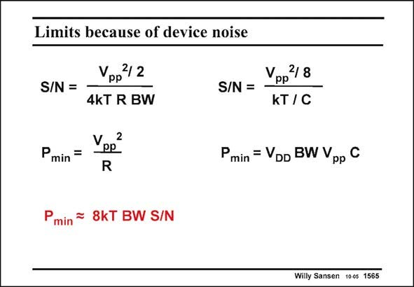

# SANSEN-1565 · Limits because of device noise

章节：15 失调与共模抑制比：随机误差及系统误差  
PDF 页：445；书本页：453；幻灯片编号：1565  
状态：unreviewed



## 对应教材讲解

### PDF 445 · 书本 453

It is clear that noise also establishes a fundamental limitation to the Dynamic Range that can be obtained at a specific frequency and a specific power level. The limit is calculated for both the thermal noise generated by a resistor R and for the noise bandwidth limited by a capacitance C. In both cases, V is pp the maximum peak-to-peak voltage that can be obtained. It is taken to be the same as the supply voltage V . It cancels out of the expression of the minimum power consumption. Only the Signal- DD to-noise ratio S/N and the bandwidth are left in this expression.

## 公式／性能结论候选摘录

以下为规则截取的原文，尚未逐项判读。

- PDF 445: It is clear that noise also establishes a fundamental limitation to the Dynamic Range that can be obtained at a specific frequency and a specific power level.
- PDF 445: The limit is calculated for both the thermal noise generated by a resistor R and for the noise bandwidth limited by a capacitance C.
- PDF 445: Only the Signal- DD to-noise ratio S/N and the bandwidth are left in this expression.

## 曲线结论候选摘录

以下为规则截取的原文，尚未逐项判读。

- PDF 445: In both cases, V is pp the maximum peak-to-peak voltage that can be obtained.

## 原文条件与近似候选摘录

以下为规则截取的原文，尚未逐项判读。

（未由规则找到；不代表原页没有此类内容。）

## 幻灯片 OCR（未校正）

```text
Limits because of device noise
Vpp2/2
S/N =
4KT R BW
Pmin =
Ve2
R
S/N =
Vpp2/8
kT/C
Pmin = VDD BW Vpp C
P
min
= 8kT BW S/N
Willy Sansen 100s 1565
```

数学上下标、分数及正负号以原图为准。电路图已保留；未核对的连接不输出成可仿真 netlist。
