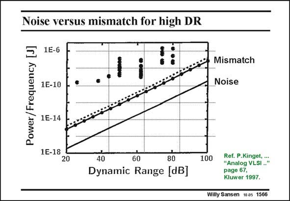

# SANSEN-1566 · Noise versus mismatch for high DR

章节：15 失调与共模抑制比：随机误差及系统误差  
PDF 页：446；书本页：454；幻灯片编号：1566  
状态：unreviewed



## 对应教材讲解

### PDF 446 · 书本 454

Both the Dynamic Range limited by distortion (mismatch) and by noise are given in the graph in this slide. The power consumption required to carry out a certain function (filter, ADC, ...) at a certain frequency is plotted versus the required dynamic range. The curves are calculated with the expressions given before. A number of experimental points are given as well. They are taken from papers in the IEEE Journal of Solid- State Circuits. They reflect data from ADC’s, from continuous-time and switched-capacitor filters (without the power consumption due to the clocks). It is clear that mismatch data presents a more realistic estimate of the power/frequency ratio for a certain dynamic range than the noise does. Mismatch is now a more severe limit to the accuracy of analog integrated circuits than noise.

## 公式／性能结论候选摘录

以下为规则截取的原文，尚未逐项判读。

- PDF 446: Both the Dynamic Range limited by distortion (mismatch) and by noise are given in the graph in this slide.
- PDF 446: Mismatch is now a more severe limit to the accuracy of analog integrated circuits than noise.

## 曲线结论候选摘录

以下为规则截取的原文，尚未逐项判读。

- PDF 446: The power consumption required to carry out a certain function (filter, ADC, ...) at a certain frequency is plotted versus the required dynamic range.
- PDF 446: The curves are calculated with the expressions given before.

## 原文条件与近似候选摘录

以下为规则截取的原文，尚未逐项判读。

（未由规则找到；不代表原页没有此类内容。）

## 幻灯片 OCR（未校正）

```text
Noise versus mismatch for high DR
1E-6
Power / Frequency
1E-10
Mismatch
Noise
1E-14
1E-18
20
8-
80
Dynamic Range [dBJ
100
Ref. P.Kinget, ...
"Analog VLSI .."
page 67,
Kluwer 1997.
Willy Sansen 1005 1566
```

数学上下标、分数及正负号以原图为准。电路图已保留；未核对的连接不输出成可仿真 netlist。
