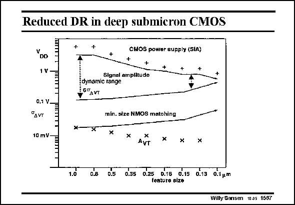

# SANSEN-1567 · Reduced DR in deep submicron CMOS

章节：15 失调与共模抑制比：随机误差及系统误差  
PDF 页：446；书本页：454；幻灯片编号：1567  
状态：unreviewed



## 对应教材讲解

### PDF 446 · 书本 454

As a conclusion to this Chapter, another point of concern is given about the maximum dynamic range for deep submicron CMOS. For ever smaller channel lengths, the supply voltage is shrinking, as predicted by the SIA roadmap (see Chapter 1). The maximum signal amplitude is a constant fraction of the supply voltage, determined by the distortion allowed. The parameter A VT describing the spreading on the threshold voltage decreases but if minimum-size devices are taken, the spreading on the V T increases. If six times this spreading is taken, then only a small voltage dynamic range is left. It seems to go to zero for CMOS technologies beyond 90 nm. A few obvious applications can live with such small dynamic ranges. Some biomedical applications are happy with 20 dB, but most communication applications require more than 70 dB! To

### PDF 447 · 书本 455

reach such values, the supply voltage cannot be allowed to decrease, the distortion must be reduced (see Chapter 18) and larger than minimum-size transistors will have to be used. The analog parts of a mixed-signal chip will consume more and more of the total area, as has already been seen.

## 公式／性能结论候选摘录

以下为规则截取的原文，尚未逐项判读。

- PDF 446: As a conclusion to this Chapter, another point of concern is given about the maximum dynamic range for deep submicron CMOS.
- PDF 446: The parameter A VT describing the spreading on the threshold voltage decreases but if minimum-size devices are taken, the spreading on the V T increases.
- PDF 447: reach such values, the supply voltage cannot be allowed to decrease, the distortion must be reduced (see Chapter 18) and larger than minimum-size transistors will have to be used.

## 曲线结论候选摘录

以下为规则截取的原文，尚未逐项判读。

（未由规则找到；不代表原页没有此类内容。）

## 原文条件与近似候选摘录

以下为规则截取的原文，尚未逐项判读。

（未由规则找到；不代表原页没有此类内容。）

## 幻灯片 OCR（未校正）

```text
Reduced DR in deep submicron CMOS
"DD
CMOS power supply (SIA)
+
+
Signal ampiitudo
edynamtc range
1G°A VT
0,1 V.
"Avr
10 mV-
x-
min. size NMOS matohing
X
X
AVT
x
x
x
0.8
0.5 0.35 0.25 D.TB
dus o.is 01um
featura size
Willy Sansen 10-05 1587
```

数学上下标、分数及正负号以原图为准。电路图已保留；未核对的连接不输出成可仿真 netlist。
