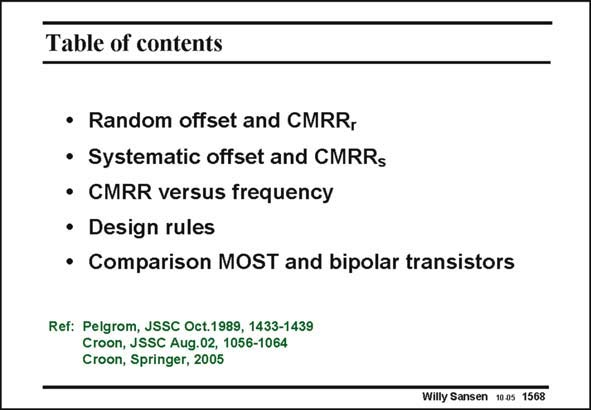

# SANSEN-1568 · Table of contents

章节：15 失调与共模抑制比：随机误差及系统误差  
PDF 页：447；书本页：455；幻灯片编号：1568  
状态：unreviewed



## 对应教材讲解

### PDF 447 · 书本 455

In this Chapter an overview of the mechanisms are given which play a role in mismatch. Both random and systematic mismatch have been discussed. It is shown that mismatch leads to specification such as offset and CMRR, which are thus related to each other. Layout techniques are listed which can be applied to improve matching. Inevitably they lead to larger chip sizes. Finally a short comparison is provided with bipolar transistor matching. Also, an attempt is made to establish the limits in power for dynamic range and frequency in both cases, when mismatch is a limit and when noise is a limit. It is shown that mismatch is the most severe.

## 公式／性能结论候选摘录

以下为规则截取的原文，尚未逐项判读。

- PDF 447: It is shown that mismatch leads to specification such as offset and CMRR, which are thus related to each other.
- PDF 447: Also, an attempt is made to establish the limits in power for dynamic range and frequency in both cases, when mismatch is a limit and when noise is a limit.

## 曲线结论候选摘录

以下为规则截取的原文，尚未逐项判读。

（未由规则找到；不代表原页没有此类内容。）

## 原文条件与近似候选摘录

以下为规则截取的原文，尚未逐项判读。

- PDF 447: Finally a short comparison is provided with bipolar transistor matching.

## 幻灯片 OCR（未校正）

```text
Table of contents
• Random offset and CMRR,
• Systematic offset and CMRRs
• CMRR versus frequency
• Design rules
• Comparison MOST and bipolar transistors
Ref: Pelgrom, JSSC Oct.1989, 1433-1439
Croon, JSSC Aug.02, 1056-1064
Croon, Springer, 2005
Willy Sansen 100 1568
```

数学上下标、分数及正负号以原图为准。电路图已保留；未核对的连接不输出成可仿真 netlist。
