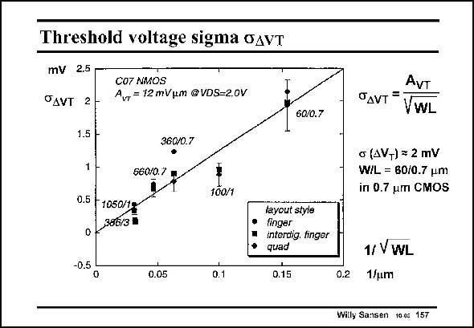

# SANSEN-157 · Threshold voltage sigma oAvT

章节：15 失调与共模抑制比：随机误差及系统误差  
PDF 页：416；书本页：424；幻灯片编号：157  
状态：unreviewed



## 对应教材讲解

### PDF 416 · 书本 424

In order to illustrate this dependency on size, a measurement curve is shown in this slide. The smaller sizes are on the right of the horizontal axis. It is clear that for smaller sizes the spreading is larger as well. The slope on the other hand, corresponds to a A VT factor of about 12 mVmm. This is for a 0.7 micrometer CMOS technology, which has an oxide thickness of about 700/50 or 14 nm. As a rule of thumb, the value of the A factor in mVmm can be taken to be about the same as the VT oxide thickness in nm. This is shown on the next slide. Note also that the layout style does not make all that much difference. Whether a finger layout is used or an interdigitated one seems to be unimportant. Only the total gate area WL is important. It is also clear that this curve goes through zero. This would mean that for even very small channel lengths, the oxide thickness would decrease accordingly and therefore the factor A . VT Whether nanometer CMOS processing develops in this way still has to be seen, however.

## 公式／性能结论候选摘录

以下为规则截取的原文，尚未逐项判读。

- PDF 416: In order to illustrate this dependency on size, a measurement curve is shown in this slide.
- PDF 416: This would mean that for even very small channel lengths, the oxide thickness would decrease accordingly and therefore the factor A .

## 曲线结论候选摘录

以下为规则截取的原文，尚未逐项判读。

- PDF 416: In order to illustrate this dependency on size, a measurement curve is shown in this slide.
- PDF 416: The smaller sizes are on the right of the horizontal axis.
- PDF 416: The slope on the other hand, corresponds to a A VT factor of about 12 mVmm.
- PDF 416: It is also clear that this curve goes through zero.

## 原文条件与近似候选摘录

以下为规则截取的原文，尚未逐项判读。

（未由规则找到；不代表原页没有此类内容。）

## 幻灯片 OCR（未校正）

```text
Threshold voltage sigma oAvT
mV 2.5
OAVT 2
CO7 NMOS
Avr =12 mVum @VDS=2,0V
1.5 H
36010.7
1 -
06002 1
0.5 F 1050/12
0 2386/3 8
100/1
0.5.
0.05
60/0.7
AVT
OдVT =
VWL
c (AVT) = 2 mV
W/L = B0/0.7 um
in 0.7 um CMOS
layout styie
ipega mngor
quad
0.15
0.2
1/ VWL
1/um
Willy Sansen 100 157
```

数学上下标、分数及正负号以原图为准。电路图已保留；未核对的连接不输出成可仿真 netlist。
