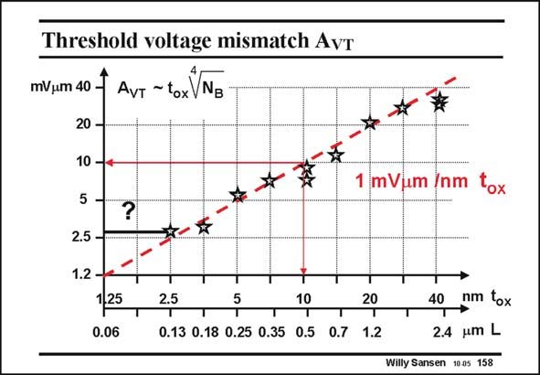

# SANSEN-158 · Threshold voltage mismatch AvT Avt ~tox VNg

章节：15 失调与共模抑制比：随机误差及系统误差  
PDF 页：416；书本页：424；幻灯片编号：158  
状态：unreviewed



## 对应教材讲解

### PDF 416 · 书本 424

The value of the A factor VT in mVmm can (as shown here) be taken to be the same as the oxide thickness in nm. Each star corresponds to a different technology. Both axes are provided, one with the oxide thickness and one with the channel length. A ratio of 50 is taken between them. This curve allows prediction of the A for future VT CMOS technologies in a fairly obvious way. Care has to be exerted however, when extrapolating to deep submicron CMOS technologies. For example, it has already been found (Tuinhout, IEDM 1997, 631–634 and more recently by Croon, Springer 2004), that below 130 nm channel lengths, several phenomena show up such that the A does not decrease any more but becomes more or less constant at a value of about VT 3 mVmm.

### PDF 417 · 书本 425

In conventional CMOS the main contribution to A is the effect of fluctuations in channel VT doping. Fluctuations in Gate doping and surface-roughness scattering are dominant in A . For WL nanometer CMOS, poly-silicon gate depletion comes in heavily. Metal Gates are expected to remedy this. More experimental evidence is required, however.

## 公式／性能结论候选摘录

以下为规则截取的原文，尚未逐项判读。

- PDF 416: For example, it has already been found (Tuinhout, IEDM 1997, 631–634 and more recently by Croon, Springer 2004), that below 130 nm channel lengths, several phenomena show up such that the A does not decrease any more but becomes more or less constant at a value of about VT 3 mVmm.

## 曲线结论候选摘录

以下为规则截取的原文，尚未逐项判读。

- PDF 416: Both axes are provided, one with the oxide thickness and one with the channel length.
- PDF 416: This curve allows prediction of the A for future VT CMOS technologies in a fairly obvious way.

## 原文条件与近似候选摘录

以下为规则截取的原文，尚未逐项判读。

- PDF 416: Both axes are provided, one with the oxide thickness and one with the channel length.

## 幻灯片 OCR（未校正）

```text
Threshold voltage mismatch AvT
mV/um 40 €
Avt ~tox VNg
20 -
10 -4
5
?
2.5 -
1.2 -
1,25
0.06
2.5
10
20
T
T
T
0.13 0.18 0.25 0.35 0.5 0.7 1.2
mVum /nm tox
T
40
nm tox
2.4
umL
Willy Sansen 1005 158
```

数学上下标、分数及正负号以原图为准。电路图已保留；未核对的连接不输出成可仿真 netlist。
