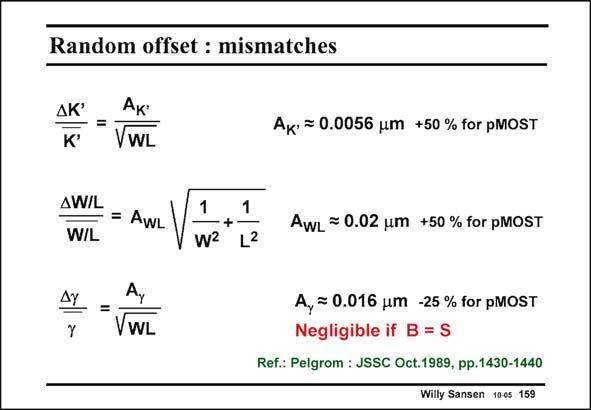

# SANSEN-159 · Random offset : mismatches

章节：15 失调与共模抑制比：随机误差及系统误差  
PDF 页：417；书本页：425；幻灯片编号：159  
状态：unreviewed



## 对应教材讲解

### PDF 417 · 书本 425

The other transistor parameters are subject to similar spreadings. An expression can be established for the K∞ parameter in a similar way as for the threshold voltage. However, its parameter A K∞ is quite small. The same applies to the dimensions W and L. Photolithography and mask making play a role in this expression. It is clear that the smaller dimension W or L plays the dominant role. The A parameter is larger than A . It is also larger for a pMOST than for a nMOST. Its WL VT value does not seem to change all that much with technology. It is still around 2%mm for minimum feature sizes. Finally, the substrate effect parameter g has a similar expression as well. When the Bulk is shorted to the Source, the effect of this parameter spreading can be neglected. We will do so whenever possible. This is why most input stages of operational amplifiers use pMOSTs. They can be put in the same n-well. Their matching can now be expected to improve.

## 公式／性能结论候选摘录

以下为规则截取的原文，尚未逐项判读。

（未由规则找到；不代表原页没有此类内容。）

## 曲线结论候选摘录

以下为规则截取的原文，尚未逐项判读。

（未由规则找到；不代表原页没有此类内容。）

## 原文条件与近似候选摘录

以下为规则截取的原文，尚未逐项判读。

- PDF 417: When the Bulk is shorted to the Source, the effect of this parameter spreading can be neglected.

## 幻灯片 OCR（未校正）

```text
Random offset : mismatches
ДК'
K*
=
VWL
AW/L
=
AWL
W/L
AY
Y
VWL
1
-+•
W2
1
L2
Aк• = 0.0056 um +50 % for pMOST
AwL = 0.02 um +50 % for pMOST
A, = 0.016 um -25 % for pMOST
Negligible if B = S
Ref.: Pelgrom : JSSC Oct.1989, pp.1430-1440
Willy Sansen 100s 159
```

数学上下标、分数及正负号以原图为准。电路图已保留；未核对的连接不输出成可仿真 netlist。
