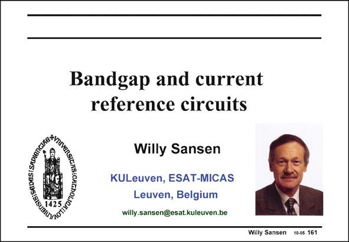

# SANSEN-161 · Slide 161

章节：16 带隙基准与电流基准电路  
PDF 页：448；书本页：457；幻灯片编号：161  
状态：unreviewed



## 对应教材讲解

### PDF 448 · 书本 457

Bandgap references are directly derived from the bandgap of silicon. This is why they provide the only real voltage reference, which is available. It is about 1.2 V. A current reference does not actually exist. They are derived from the bandgap voltage references and one or two resistors. In this Chapter, we will see how a voltage reference can be realized, the absolute value of which is highly accurate. Moreover, its temperature coefficient can be reduced to ppm’s per degree Celsius. As a consequence, they can be used over very large temperature ranges.

## 公式／性能结论候选摘录

以下为规则截取的原文，尚未逐项判读。

（未由规则找到；不代表原页没有此类内容。）

## 曲线结论候选摘录

以下为规则截取的原文，尚未逐项判读。

（未由规则找到；不代表原页没有此类内容。）

## 原文条件与近似候选摘录

以下为规则截取的原文，尚未逐项判读。

（未由规则找到；不代表原页没有此类内容。）

## 幻灯片 OCR（未校正）

```text
RGITGHBICKChOLICOHNO
1425
BugIGONS SPApS:ati8)
Bandgap and current
reference circuits
Willy Sansen
KULeuven, ESAT-MICAS
Leuven, Belgium
willy.sansen@esat.kuleuven.be
Willy Sansen 10-05 161
```

数学上下标、分数及正负号以原图为准。电路图已保留；未核对的连接不输出成可仿真 netlist。
